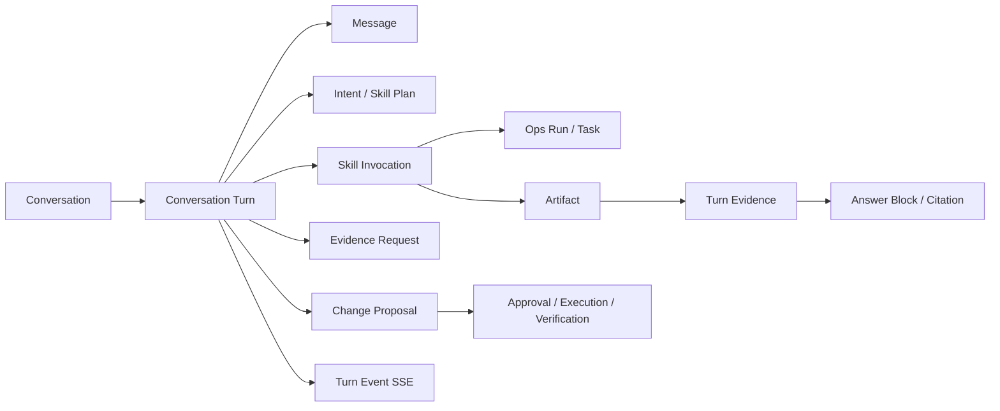
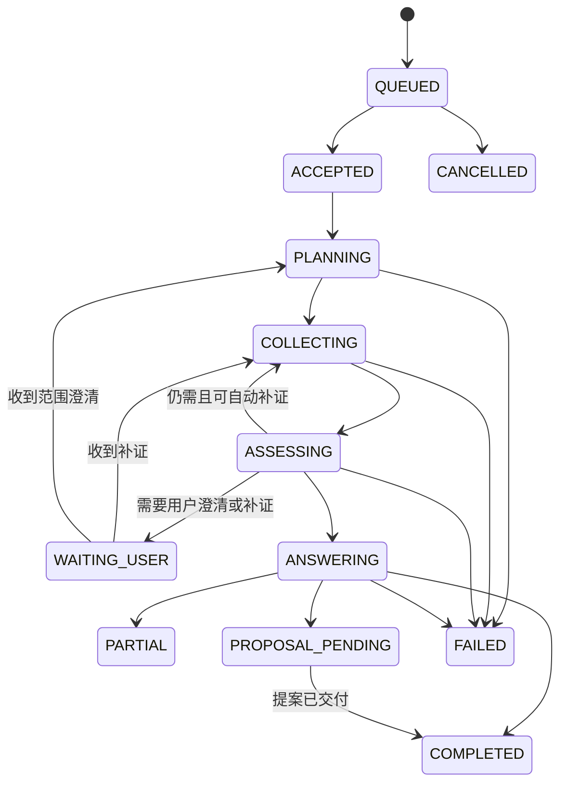

# AIOps Agent 专业 DBA 对话诊断详细设计

## 1. 文档范围

本文把产品层的
[AIOps Agent 专业 DBA 对话诊断设计](../product/aiops-agent-chat-diagnosis.md)
下钻为可实施的服务、Oracle 表结构、领域对象、API、SSE、Skill、事务和验收设计。
现有代码差距、改造边界和分阶段落地顺序见
[AIOps Agent 专业 DBA 对话诊断改造方案与实施计划](../proposals/aiops-agent-chat-implementation-plan.md)。
本文只覆盖人工发起的智能诊断，以及从告警或巡检结果进入后的持续对话；自动告警诊断
和日常巡检继续使用各自 Blueprint，但共享 Artifact、Skill、Change Proposal 和执行器。

目标是一次性替换当前“每条消息固定启动 `diagnosis.root-cause`”的实现。KBot 4.0 不增加
旧表双写、旧事件兼容或 V1/V2 并行读取。数据库实施时更新规范 DDL、重建文件、Manifest、
Entity、Repository、UoW、契约、OpenAPI、前端和测试；本文本身不执行数据库变更。

## 2. 当前实现与差距

当前 Oracle Manifest 为 Schema 12、`aiops-oracle-v2`，共有35张表和10个视图。聊天相关
结构为：

```text
KBOT_OPS_CONVERSATION
├── KBOT_OPS_CONVERSATION_MESSAGE
├── KBOT_OPS_CONVERSATION_RUN ── KBOT_OPS_RUN
├── KBOT_OPS_EVIDENCE_REQUEST
├── KBOT_OPS_ACTION_STEP
└── KBOT_OPS_IMAGE_EVIDENCE
```

主要差距：

1. 没有Turn，Message、Run、证据和回答不能按本轮问题形成数据库级边界。
2. 创建消息后直接使用`diagnosis.root-cause`，观察、解释、规划等问题也被迫进入根因链。
3. `KBOT_OPS_RUN`状态和`ROOT_CAUSE_LEVEL`以故障诊断为中心，不适合普通DBA查询。
4. Run Event只能表达单个Run；一个Turn包含取证、变更和验证Run时没有统一SSE游标。
5. Evidence Request同时映射Conversation、HITL和Run，存在重复状态源。
6. `KBOT_OPS_ACTION_STEP`重复保存Proposal的顺序、Hash和状态，可能产生状态漂移。
7. 前端从整个Run结果推断图表，没有服务端Answer Block契约。
8. `PLAN_SNAPSHOT_JSON`混合Conversation上下文、工具目录和调查计划，缺少可查询的意图、
   Skill与充分性字段。

## 3. 目标聚合与职责



| 聚合或对象 | 权威职责 |
| --- | --- |
| `Conversation` | 连续交流、Agent版本、来源告警/巡检和归档状态 |
| `ConversationTurn` | 本轮输入、Target范围、意图、Skill计划、充分性和回答生命周期 |
| `OpsRun` | 后台执行容器、任务租约、重试、超时和取消，不代表聊天语义 |
| `SkillInvocation` | 某版本DBA Skill的一次受控调用及其输入输出 |
| `Artifact` | 不可变原始证据、计划、模型输出或诊断产物 |
| `TurnEvidence` | Artifact在本轮中的用途、新鲜度、测量口径和支持/反证关系 |
| `AnswerBlock` | 服务端批准的Markdown、表格、图表、补证、提案或验证展示 |
| `TurnEvent` | 当前Turn面向用户的可重放流式事件 |

Conversation不再使用`WAITING_EVIDENCE`表达某轮状态；等待补证属于Turn。Run不再承担
Conversation的标题、消息顺序或用户展示内容。

## 4. Target范围解析

Agent创建时Target仍可不选，这表示Agent没有数据库直连能力，不表示诊断对象不存在。
每个Turn在进入Skill规划前必须解析出一个`resolved_target_id`：

1. Agent版本绑定Target时直接使用该Target；Target没有诊断凭据时仍可进行监控诊断。
2. Agent没有绑定Target时，从所选Diagnostic Source的有效Target Source Binding求交集。
3. 只得到一个Target时自动选择；得到多个时由用户从允许列表选择，不能由LLM猜测。
4. 没有Target映射时返回`AIOPS_TARGET_SCOPE_UNRESOLVED`，引导管理员补充来源映射。
5. 从告警或巡检续聊时，来源Situation/Run/Report的Target优先，且必须属于Agent允许范围。

因此`KBOT_OPS_RUN.TARGET_ID`继续保持非空。数据库直连是否可用由Target诊断凭据和
连接状态决定，不通过把Run的Target设为空来表达。

## 5. Oracle表结构目标态

目标Schema定为13，契约升级为`aiops-oracle-v3`。保留现有业务数据表分类，聊天部分
形成40张表、10个视图的目标总量：新增6张Turn子表，以`KBOT_OPS_TURN_RUN`替换
`KBOT_OPS_CONVERSATION_RUN`，删除重复的`KBOT_OPS_ACTION_STEP`。

### 5.1 表变更总表

| 表 | 动作 | 关键变化 |
| --- | --- | --- |
| `KBOT_OPS_TARGET` | 修改 | 增加`(TARGET_ID, DOMAIN_ID)`租户归属唯一键 |
| `KBOT_OPS_AGENT_VERSION` | 修改 | 增加`(AGENT_VERSION_ID, AGENT_ID)`版本归属唯一键 |
| `KBOT_OPS_CONVERSATION` | 修改 | 增加标题和Turn序号；状态只表达会话生命周期 |
| `KBOT_OPS_CONVERSATION_TURN` | 新增 | 本轮问题的权威聚合根 |
| `KBOT_OPS_CONVERSATION_MESSAGE` | 重建 | 强制归属Turn，增加Payload Schema |
| `KBOT_OPS_TURN_RUN` | 新增 | 替换Conversation Run，关联本轮的多个Run |
| `KBOT_OPS_SKILL_INVOCATION` | 新增 | 固化Skill版本、Manifest Hash及调用结果 |
| `KBOT_OPS_TURN_EVIDENCE` | 新增 | 显式关联本轮批准使用的Artifact |
| `KBOT_OPS_ANSWER_BLOCK` | 新增 | 保存服务端展示块 |
| `KBOT_OPS_ANSWER_CITATION` | 新增 | Answer Block到本轮证据的引用 |
| `KBOT_OPS_TURN_EVENT` | 新增 | Turn级SSE事件和统一游标 |
| `KBOT_OPS_EVIDENCE_REQUEST` | 重建 | 改为归属Turn，以Artifact承载查询和回复 |
| `KBOT_OPS_IMAGE_EVIDENCE` | 修改 | 通过Evidence Request和Turn归属本轮 |
| `KBOT_OPS_CHANGE_PROPOSAL` | 修改 | 增加Turn外键，Proposal自身成为动作步骤 |
| `KBOT_OPS_ACTION_STEP` | 删除 | 消除与Proposal重复的顺序、Hash和状态 |
| `KBOT_OPS_RUN` | 修改 | 通用化工作流状态，冻结Agent版本 |
| `KBOT_OPS_TASK` | 修改 | 增加意图、Skill、充分性和回答任务类型 |
| `KBOT_OPS_HITL` | 修改 | 不再承载诊断补证，只保留变更审批和人工执行结果 |

### 5.2 `KBOT_OPS_CONVERSATION`

保留来源字段和不可变`AGENT_ID/AGENT_VERSION_ID`，新增：

| 列 | 类型 | 规则 |
| --- | --- | --- |
| `TITLE` | `VARCHAR2(256 CHAR)` | 首轮提交后由服务端生成，可由用户修改 |
| `LAST_TURN_NO` | `NUMBER(19)` | 默认0，只在锁定Conversation后递增 |
| `LAST_MESSAGE_NO` | `NUMBER(19)` | 默认0，只在锁定Conversation后递增 |
| `UPDATED_BY` | `VARCHAR2(256 CHAR)` | 最近修改者 |

`STATUS`只允许`ACTIVE/RESOLVED/ARCHIVED`。删除`WAITING_EVIDENCE`。在Agent Version建立
`UK_OPS_AGENT_VER_OWNER(AGENT_VERSION_ID, AGENT_ID)`，Conversation通过
`FK_OPS_CONV_AGENT_VER_OWNER(AGENT_VERSION_ID, AGENT_ID)`引用，确保冻结版本确实属于
所选Agent。Conversation另建`(CONVERSATION_ID, DOMAIN_ID)`唯一键供Turn复合外键使用。
保留`IX_OPS_CONVERSATION_SCOPE(DOMAIN_ID, STATUS, UPDATED_AT)`。

### 5.3 `KBOT_OPS_CONVERSATION_TURN`

```text
TURN_ID                    RAW(16) PK
DOMAIN_ID                  NUMBER(38) NOT NULL
CONVERSATION_ID            RAW(16) NOT NULL
TURN_NO                    NUMBER(19) NOT NULL
IDEMPOTENCY_KEY            VARCHAR2(128 CHAR) NOT NULL
STATUS                     VARCHAR2(24 CHAR) NOT NULL
RESOLVED_TARGET_ID         RAW(16)
PRIMARY_INTENT             VARCHAR2(24 CHAR)
PRIMARY_DOMAIN             VARCHAR2(48 CHAR)
SUBJECT                    VARCHAR2(64 CHAR)
INTENT_SCHEMA_VERSION      VARCHAR2(64 CHAR)
INTENT_PLAN_JSON           JSON
INTENT_PLAN_ARTIFACT_ID    RAW(16)
SKILL_PLAN_SCHEMA_VERSION  VARCHAR2(64 CHAR)
SKILL_PLAN_JSON            JSON
SKILL_PLAN_ARTIFACT_ID     RAW(16)
SUFFICIENCY_STATUS         VARCHAR2(32 CHAR)
SUFFICIENCY_JSON           JSON
SUFFICIENCY_ARTIFACT_ID    RAW(16)
EVENT_CURSOR               NUMBER(19) DEFAULT 0 NOT NULL
ERROR_DOMAIN               VARCHAR2(32 CHAR)
ERROR_CODE                 VARCHAR2(128 CHAR)
ERROR_MESSAGE              VARCHAR2(2000 CHAR)
ROW_VERSION                NUMBER(19) DEFAULT 1 NOT NULL
CREATED_BY                 VARCHAR2(256 CHAR) NOT NULL
CREATED_AT / STARTED_AT / COMPLETED_AT / UPDATED_AT
CANCEL_REQUESTED_AT / CANCEL_REQUESTED_BY
```

约束：

- `UK_OPS_TURN_NO(CONVERSATION_ID, TURN_NO)`；
- `UK_OPS_TURN_IDEMP(CONVERSATION_ID, IDEMPOTENCY_KEY)`；
- 状态为`QUEUED`、`ACCEPTED`、`PLANNING`、`COLLECTING`、`ASSESSING`、
  `ANSWERING`、`WAITING_USER`、`PROPOSAL_PENDING`、`COMPLETED`、`PARTIAL`、
  `FAILED`、`CANCELLED`；
- 只有`PLANNING/COLLECTING/ASSESSING/ANSWERING`属于执行中状态，通过函数唯一索引保证
  同一Conversation最多一个执行中Turn；`QUEUED`可有多个；
- `PRIMARY_INTENT`使用七个一级意图；`SUFFICIENCY_STATUS`使用
  `ANSWERABLE/PARTIAL/NEEDS_CLARIFICATION/NEEDS_EVIDENCE/CAPABILITY_UNAVAILABLE/UNSAFE`；
- `RESOLVED_TARGET_ID`在离开`PLANNING`前必须非空，由应用状态迁移校验；
- 索引`(DOMAIN_ID, STATUS, UPDATED_AT)`、`(CONVERSATION_ID, STATUS, TURN_NO)`和
  `(RESOLVED_TARGET_ID, STATUS, CREATED_AT)`。

Intent Plan、Skill Plan和充分性的当前投影保存在JSON中，可查询的主意图、主领域、对象和
状态提升为列。每个版本同时写为不可变Artifact并由对应`*_ARTIFACT_ID`引用；重新规划时
创建包含递增`revision`的新Artifact，再更新当前投影并生成事件，不能丢失或静默覆盖已经
执行过的计划。

Turn使用`(CONVERSATION_ID, DOMAIN_ID)`和`(RESOLVED_TARGET_ID, DOMAIN_ID)`复合外键。
Target相应增加`UK_OPS_TARGET_OWNER(TARGET_ID, DOMAIN_ID)`，由数据库而不只是应用代码
阻止跨Domain拼接。

### 5.4 Message与Turn Run

`KBOT_OPS_CONVERSATION_MESSAGE`重建为：

```text
MESSAGE_ID          RAW(16) PK
CONVERSATION_ID     RAW(16) NOT NULL
TURN_ID             RAW(16) NOT NULL
SEQUENCE_NO         NUMBER(19) NOT NULL
ROLE                VARCHAR2(16 CHAR) NOT NULL
MESSAGE_TYPE        VARCHAR2(32 CHAR) NOT NULL
PAYLOAD_SCHEMA      VARCHAR2(64 CHAR) NOT NULL
PAYLOAD_JSON        JSON NOT NULL
ARTIFACT_ID         RAW(16)
CREATED_BY          VARCHAR2(256 CHAR)
CREATED_AT          TIMESTAMP WITH TIME ZONE NOT NULL
```

`ROLE`为`USER`、`AGENT`、`SYSTEM`；`MESSAGE_TYPE`为`USER_MESSAGE`、
`ASSISTANT_MESSAGE`、`USER_EVIDENCE`、`SYSTEM_CONTEXT`。`AGENT_PROGRESS`和
`EVIDENCE_REQUEST`不再伪装成Message，
分别使用Turn Event和Answer Block。保留`(CONVERSATION_ID, SEQUENCE_NO)`唯一约束，新增
`(TURN_ID, CREATED_AT)`索引。一个Turn只能有一条`USER_MESSAGE`，通过函数唯一索引保证。

`KBOT_OPS_TURN_RUN`字段为`TURN_RUN_ID`、`TURN_ID`、`OPS_RUN_ID`、`PURPOSE`、
`SEQUENCE_NO`、`CREATED_AT`。`PURPOSE`允许`PRIMARY`、`EVIDENCE_BRANCH`、`CHANGE`、
`VERIFICATION`、`MEDIA_PROCESSING`；`OPS_RUN_ID`全局唯一，`(TURN_ID, SEQUENCE_NO)`唯一，函数唯一索引
保证每个Turn只有一个`PRIMARY` Run。

### 5.5 `KBOT_OPS_SKILL_INVOCATION`

```text
SKILL_INVOCATION_ID  RAW(16) PK
TURN_ID              RAW(16) NOT NULL
PARENT_INVOCATION_ID RAW(16)
OPS_RUN_ID           RAW(16) NOT NULL
OPS_TASK_ID          RAW(16)
ORDINAL              NUMBER(10) NOT NULL
SKILL_ID             VARCHAR2(128 CHAR) NOT NULL
SKILL_VERSION        VARCHAR2(64 CHAR) NOT NULL
MANIFEST_HASH        VARCHAR2(64 CHAR) NOT NULL
PRIMARY_INTENT       VARCHAR2(24 CHAR) NOT NULL
PRIMARY_DOMAIN       VARCHAR2(48 CHAR) NOT NULL
STATUS               VARCHAR2(24 CHAR) NOT NULL
INPUT_SCHEMA_VERSION VARCHAR2(64 CHAR) NOT NULL
INPUT_JSON           JSON NOT NULL
OUTPUT_ARTIFACT_ID   RAW(16)
ATTEMPT_COUNT        NUMBER(8) DEFAULT 0 NOT NULL
ERROR_DOMAIN         VARCHAR2(32 CHAR)
ERROR_CODE           VARCHAR2(128 CHAR)
ERROR_MESSAGE        VARCHAR2(2000 CHAR)
STARTED_AT / COMPLETED_AT / CREATED_AT / UPDATED_AT
ROW_VERSION          NUMBER(19) DEFAULT 1 NOT NULL
```

`STATUS`为`PLANNED/READY/RUNNING/SUCCEEDED/PARTIAL/FAILED/SKIPPED/CANCELLED`。
`INPUT_JSON`只能保存经Schema校验和脱敏后的Skill参数，不保存用户名、密码、完整DSN或密钥。
唯一约束为`(TURN_ID, ORDINAL)`；索引覆盖`(TURN_ID, STATUS, ORDINAL)`、
`(SKILL_ID, SKILL_VERSION, CREATED_AT)`、`OPS_TASK_ID`和父调用。

### 5.6 `KBOT_OPS_TURN_EVIDENCE`

```text
TURN_EVIDENCE_ID      RAW(16) PK
TURN_ID               RAW(16) NOT NULL
ARTIFACT_ID           RAW(16) NOT NULL
SKILL_INVOCATION_ID   RAW(16)
EVIDENCE_ROLE         VARCHAR2(24 CHAR) NOT NULL
MEASUREMENT_SEMANTICS VARCHAR2(32 CHAR) NOT NULL
OBSERVED_AT           TIMESTAMP WITH TIME ZONE
WINDOW_START_AT       TIMESTAMP WITH TIME ZONE
WINDOW_END_AT         TIMESTAMP WITH TIME ZONE
FRESHNESS_STATUS      VARCHAR2(16 CHAR) NOT NULL
USAGE_REASON          VARCHAR2(1000 CHAR) NOT NULL
LINKED_BY             VARCHAR2(256 CHAR) NOT NULL
LINKED_AT             TIMESTAMP WITH TIME ZONE NOT NULL
```

`EVIDENCE_ROLE`为`SUPPORTS`、`CONTRADICTS`、`CONTEXT`、`USER_PROVIDED`；测量语义为
`CURRENT_ACTIVITY`、`CUMULATIVE_SINCE_LOAD`、`SNAPSHOT_DELTA`、
`HISTORICAL_SAMPLES`、`NOT_APPLICABLE`；新鲜度为`FRESH`、`STALE`、`UNKNOWN`。唯一约束
`(TURN_ID, ARTIFACT_ID, EVIDENCE_ROLE)`，并索引Artifact和Skill Invocation。

时间窗必须同时为空或同时非空且结束晚于开始。`CUMULATIVE_SINCE_LOAD`不能满足一个
有界增量时间窗的证据要求；该规则由Sufficiency Evaluator确定性校验。

### 5.7 Answer Block与Citation

`KBOT_OPS_ANSWER_BLOCK`：

```text
ANSWER_BLOCK_ID  RAW(16) PK
TURN_ID          RAW(16) NOT NULL
MESSAGE_ID       RAW(16) NOT NULL
BLOCK_NO         NUMBER(10) NOT NULL
BLOCK_TYPE       VARCHAR2(32 CHAR) NOT NULL
SCHEMA_VERSION   VARCHAR2(64 CHAR) NOT NULL
PAYLOAD_JSON     JSON NOT NULL
CONTENT_HASH     VARCHAR2(64 CHAR) NOT NULL
STATUS           VARCHAR2(16 CHAR) NOT NULL
SUPERSEDES_ID    RAW(16)
CREATED_AT       TIMESTAMP WITH TIME ZONE NOT NULL
```

`BLOCK_TYPE`白名单为`MARKDOWN`、`TABLE`、`CHART`、`EVIDENCE_REFERENCES`、
`CLARIFICATION`、`EVIDENCE_REQUEST`、`PROPOSAL_SUMMARY`、
`VERIFICATION_COMPARISON`，映射产品
契约中的`answer.*`等外部名称。`STATUS`为`ACTIVE/SUPERSEDED`。唯一约束
`(MESSAGE_ID, BLOCK_NO)`；同一序号发生语义修订时创建新Block并设置`SUPERSEDES_ID`，
不覆盖历史内容。

`KBOT_OPS_ANSWER_CITATION`以`(ANSWER_BLOCK_ID, CITATION_NO)`为主键，保存
`TURN_EVIDENCE_ID`和`LABEL`，并对`(ANSWER_BLOCK_ID, TURN_EVIDENCE_ID)`建立唯一约束。
因此正文引用、表格、图表都只能引用当前Turn已经批准的证据。

### 5.8 `KBOT_OPS_TURN_EVENT`

```text
TURN_ID             RAW(16) NOT NULL
SEQUENCE_NO         NUMBER(19) NOT NULL
EVENT_TYPE          VARCHAR2(64 CHAR) NOT NULL
EVENT_KEY           VARCHAR2(128 CHAR)
VISIBILITY          VARCHAR2(16 CHAR) NOT NULL
SKILL_INVOCATION_ID RAW(16)
ANSWER_BLOCK_ID     RAW(16)
PAYLOAD_JSON        JSON NOT NULL
CREATED_AT          TIMESTAMP WITH TIME ZONE NOT NULL
PRIMARY KEY (TURN_ID, SEQUENCE_NO)
```

在锁定Turn后递增`EVENT_CURSOR`并插入事件，保证无空洞的单调游标。`EVENT_KEY`在同一Turn
内唯一以支持幂等重试。`VISIBILITY`为`INTERNAL/USER`；只有USER事件可经Main API返回。
Run Event继续用于Worker和运行审计，应用服务把用户可理解的阶段投影为Turn Event，前端
不直接拼接多个Run Event流。

### 5.9 Evidence Request、图片与变更

`KBOT_OPS_EVIDENCE_REQUEST`删除`CONVERSATION_ID/SUGGESTED_SQL/SQL_HASH`，改为：

- `TURN_ID`、`PARENT_REQUEST_ID`和`REQUEST_TYPE`；
- `INSTRUCTION_TEXT`：向用户说明为何需要和如何获取；
- `REQUEST_SCHEMA_VERSION/REQUEST_JSON`：受控输入要求；
- `QUERY_ARTIFACT_ID`：可选的已登记只读SQL或命令Artifact；
- `RESPONSE_ARTIFACT_ID`：用户文字、文件或解析结果Artifact；
- `STATUS/FAILURE_CLASS/ROW_VERSION/REQUESTED_BY/CREATED_AT/UPDATED_AT/EXPIRES_AT`。

`REQUEST_TYPE`为`TEXT/SQL_OUTPUT/COMMAND_OUTPUT/SCREENSHOT/FILE`，状态为
`OPEN/RECEIVED/SKIPPED/FAILED/EXPIRED/CANCELLED`。提交结果时同一事务创建Artifact、
Turn Evidence、User Evidence Message并更新请求；不再同时维护一份诊断型HITL状态。

`KBOT_OPS_IMAGE_EVIDENCE`用`TURN_ID`替换`CONVERSATION_ID`，保留请求、源Artifact、
模型版本、输入Hash和输出Artifact。OCR/VLM输出只有经过用户确认或确定性字段校验后才
成为可支持结论的Turn Evidence。

`KBOT_OPS_CHANGE_PROPOSAL`增加非空`TURN_ID`和索引`(TURN_ID, STATUS, COMMAND_ORDINAL)`。
`SOLUTION_GROUP_KEY + COMMAND_ORDINAL + PROPOSAL_VERSION`已经表达步骤和修订，因此删除
`KBOT_OPS_ACTION_STEP`。Proposal Hash改变时生成新版本并把旧版本设为`SUPERSEDED`。

`KBOT_OPS_HITL.REQUEST_TYPE`删除`DATA_REQUIRED/MANUAL_DIAGNOSTIC_SQL`，仅保留
`CHANGE_APPROVAL/MANUAL_ACTION_RESULT`。普通聊天文本和Evidence Request都不能改变
Proposal状态。

### 5.10 Run与Task通用化

`KBOT_OPS_RUN`增加`AGENT_VERSION_ID`，将`INVESTIGATION_MODE`替换为`WORKFLOW_KIND`：

```text
ALERT_DIAGNOSIS | INSPECTION | CHAT_TURN | CHANGE | VERIFICATION
```

Run状态收敛为`CREATED`、`QUEUED`、`RUNNING`、`WAITING_INPUT`、
`WAITING_APPROVAL`、`COMPLETED`、`PARTIAL`、`FAILED`、`CANCELLED`、`EXPIRED`。
删除Run级`ROOT_CAUSE_LEVEL`；根因等级只属于
DIAGNOSE Skill产生的Finding，不再污染观察、解释或规划Run。`PLAN_SNAPSHOT_JSON`只保存
执行DAG和目录Hash，Conversation、意图和回答计划由Turn持有。

`KBOT_OPS_TASK.TASK_TYPE`目标枚举为：

```text
INTENT_ROUTE, SKILL_PLAN, SKILL_INVOKE, EVIDENCE_ASSESS, ANSWER,
REQUEST_INPUT, PROPOSE, APPROVE, EXECUTE, VERIFY, ROLLBACK, REPORT
```

Skill的多个Tool调用可以作为同一个`SKILL_INVOKE` Task内部受控DAG，也可以在需要独立
租约时展开为子Task；无论采用哪种方式，用户界面只展示Skill Invocation。

## 6. 领域状态机

### 6.1 Turn



`WAITING_USER`和`PROPOSAL_PENDING`不是执行中状态，允许用户继续提出新问题。补证必须走
具体Evidence Request端点，普通聊天消息默认创建新Turn，避免把无关问题误当补证。

### 6.2 Skill Invocation

只有`PLANNED→READY→RUNNING`可以开始执行。成功但数据不完整使用`PARTIAL`；执行器或
来源失败使用`FAILED`；计划重排后未再需要的调用使用`SKIPPED`。一次Invocation重试只
增加`ATTEMPT_COUNT`，不生成新Invocation；输入、Skill版本或Manifest Hash变化时必须
生成新的Invocation。

### 6.3 Conversation

Conversation保持`ACTIVE`直到用户标记已解决；`RESOLVED`仍可查看和从最后上下文开启
新Conversation；`ARCHIVED`只读。Conversation状态不跟随某个Turn失败而失败。

## 7. Skill Manifest与运行目录

Skill Manifest由代码仓库拥有，建议目录为：

```text
services/aiops_agent/src/aiops_agent/skills/
├── contracts.py
├── registry.py
├── planner.py
└── catalog/
    └── oracle/<skill_id>/manifest.json
```

不新增数据库Skill配置表。Skill是随服务版本发布并经过测试的执行能力，若允许业务用户在
数据库中修改Manifest，会绕过代码审计和Executor Allowlist。每次Invocation保存
`skill_id/version/manifest_hash`，Run计划保存整个Skill目录Hash，即可重放和审计。

`DBA_SKILL_MANIFEST.v1`必须包含：

- `skill_id/version/database_types/version_range`；
- `supported_intents/domains/subjects`；
- 必需和可选的Source、Target Capability；
- 具体Oracle对象权限标识及可选授权/许可前提；
- 输入Schema、默认值、最大行数、超时、重试和成本预算；
- Tool DAG、输出Schema、测量语义、Presentation Kind；
- fallback Skill和人工补证模板；
- 敏感字段、脱敏规则和Evidence新鲜度策略。

Planner输入只能是经过校验的Intent Plan、Agent Version Snapshot、Target Capability
Snapshot和Source Capability Snapshot；输出`DBA_SKILL_PLAN.v1`，其中每个选择都包含
`reason`和要回答的`evidence_question`。LLM建议目录外Skill时由校验器拒绝并重新规划，
不能动态拼接Tool ID或SQL。

## 8. Oracle首批Skill与取证口径

首批生产验证优先级：

| Skill ID | 主要意图 | 核心Tool或来源 | 测量口径 |
| --- | --- | --- | --- |
| `oracle.instance.overview` | OBSERVE/INSPECT | 实例、启动、资源限制、Prometheus | 当前值与趋势 |
| `oracle.performance.waits` | OBSERVE/DIAGNOSE | 等待事件、会话、主机指标 | 当前活动或快照增量 |
| `oracle.sql.top_current` | OBSERVE | `V$SQLSTATS`受控查询 | `CUMULATIVE_SINCE_LOAD` |
| `oracle.sql.top_window` | OBSERVE/DIAGNOSE | 监控序列、可靠快照或授权历史源 | `SNAPSHOT_DELTA/HISTORICAL_SAMPLES` |
| `oracle.sql.detail` | OBSERVE/DIAGNOSE | SQL统计、文本摘要、子游标 | 当前与累计，敏感SQL脱敏 |
| `oracle.sql.execution_plan` | DIAGNOSE/EXPLAIN | 受控计划查询 | 指定SQL/Child Cursor |
| `oracle.session.active` | OBSERVE/DIAGNOSE | 活跃会话 | `CURRENT_ACTIVITY` |
| `oracle.session.blocking_chain` | OBSERVE/DIAGNOSE | 阻塞树与等待 | `CURRENT_ACTIVITY` |
| `oracle.transaction.long_running` | OBSERVE/DIAGNOSE | 长事务 | `CURRENT_ACTIVITY` |
| `oracle.storage.tablespace` | OBSERVE/INSPECT | 表空间、数据文件、Exporter | 当前容量与趋势 |
| `oracle.storage.temp_undo` | OBSERVE/DIAGNOSE | TEMP、UNDO | 当前与窗口统计 |
| `oracle.alert.timeline` | OBSERVE/DIAGNOSE | Loki/Alert Log Collector | `HISTORICAL_SAMPLES` |
| `oracle.dataguard.status` | OBSERVE/DIAGNOSE | Data Guard视图与监控 | 当前状态与延迟趋势 |

`top_current`和`top_window`必须是两个Skill，不能由回答模型偷偷更改口径。用户要求最近
15分钟而环境只有累计`V$SQLSTATS`时，Planner可退化到`top_current`，但充分性为PARTIAL，
回答必须说明实际口径并给出启用增量采集或历史能力的方法。

## 9. 应用服务与事务边界

### 9.1 接收用户消息

单个UoW内完成：

1. 校验Domain、Agent授权、Agent状态和版本；
2. 解析或校验Target候选；
3. 锁定Conversation，分别按`LAST_TURN_NO + 1`和`LAST_MESSAGE_NO + 1`分配Turn与
   Message序号；
4. 写入Turn、User Message、`turn.created`和Outbox任务；
5. 提交后返回Turn Receipt。

不得在事务中调用LLM、监控源或数据库。`IDEMPOTENCY_KEY`重复时返回已有Turn。
不得以`MAX(sequence_no) + 1`分配序号；所有消息，包括Assistant Message和系统消息，
都必须在锁定Conversation后递增`LAST_MESSAGE_NO`，避免并发排队Turn产生重复序号。

### 9.2 规划

Planner Worker领取Turn后，在短事务中创建或确认唯一`PRIMARY` Run，并把`ACCEPTED`
改为`PLANNING`；事务外调用LLM形成Intent候选；新事务中校验并把Intent、Skill Plan写为
该Run的不可变Artifact，同时更新Turn当前投影、创建Skill Invocation和事件。目录Hash、
Agent版本和Target能力快照都在规划时冻结。

### 9.3 取证

每个Skill Invocation独立租约。外部调用在事务外执行；完成时同一UoW写入Artifact、
Turn Evidence、Invocation状态和Turn Event。Repository不得调用`commit()`。失败必须
保存`ERROR_DOMAIN`，区分`TARGET/SOURCE/SKILL/TOOL/INTERNAL_STORE/MODEL_SERVICE`。

### 9.4 充分性与回答

Evaluator只读取本轮Turn Evidence。写入`SUFFICIENCY_JSON`后决定继续取证、等待用户或
回答。回答模型流式输出时先写Turn Event Delta；每个完整展示块通过Schema校验后写入
Answer Block、Citation和`answer.block`事件。最终同一事务写Assistant Message、
`answer.completed`及Turn终态。

### 9.5 补证与变更

补证提交事务创建Response Artifact和Turn Evidence，关闭Evidence Request并投递恢复
任务。变更提案事务写Proposal、Proposal Summary Block和审批Outbox；审批、执行和验证
继续使用现有Change UoW，但通过`TURN_ID`把结果投影回原Turn。

## 10. API详细契约

Main API保持公开前缀`/api/v1/apps/aiops`，AIOps服务使用`/internal/v1/aiops`。公开调用
只接受Portal API Key和可信Domain/用户上下文；内部调用继续要求服务凭据和短时
AuthContext JWT。

### 10.1 创建Turn

```http
POST /api/v1/apps/aiops/conversations/{conversation_id}/turns
Idempotency-Key: <uuid>
```

```json
{
  "message": "分析最近15分钟的Top SQL",
  "target_id": null
}
```

新Conversation使用`POST /conversations`，请求包含`agent_id/message/target_id`以及可选的
`source_run_id/source_report_id`。响应统一为：

```json
{
  "schema_version": "AIOPS_CONVERSATION_TURN_RECEIPT.v1",
  "conversation_id": "...",
  "turn_id": "...",
  "turn_no": 3,
  "status": "QUEUED",
  "event_cursor": 1,
  "events_url": "/api/v1/apps/aiops/conversations/.../turns/.../events"
}
```

删除请求体中的`request_report`；正式报告只由巡检、告警报告或用户显式“生成报告”Skill
产生，不能作为每条聊天消息的布尔开关。

### 10.2 查询与取消

- `GET /conversations?agent_id=&status=&cursor=&limit=`：Conversation摘要分页；
- `GET /conversations/{id}`：会话头和最近Turn摘要，不返回全部历史Payload；
- `GET /conversations/{id}/turns?before_turn_no=&limit=`：Turn分页；
- `GET /conversations/{id}/turns/{turn_id}`：本轮消息、Answer Block和引用摘要；
- `POST /conversations/{id}/turns/{turn_id}:cancel`：带`expected_row_version`取消；
- `GET /conversations/{id}/turns/{turn_id}/events?after=&limit=`：可重放事件。

取消只设置请求并投递取消事件，由Worker停止未开始的Invocation并向正在运行的Task传播；
已经产生的Artifact和审计不删除。

### 10.3 补证

- `POST /conversations/{id}/turns/{turn_id}/evidence-requests/{request_id}/text`；
- `POST .../{request_id}/uploads`；
- `POST .../{request_id}:skip`。

服务端校验Request确实属于Turn、状态为OPEN、当前用户有Conversation权限，并使用
Idempotency-Key防止重复上传。客户端不提交HITL ID、响应Schema或Run ID。

## 11. Turn SSE契约

事件信封`AIOPS_TURN_EVENT.v1`：

```json
{
  "conversation_id": "...",
  "turn_id": "...",
  "sequence_no": 12,
  "event_type": "skill.progress",
  "occurred_at": "2026-08-27T10:00:00+08:00",
  "correlation": {
    "skill_invocation_id": "...",
    "answer_block_id": null
  },
  "payload": {
    "summary": "正在查询最近15分钟SQL统计"
  }
}
```

用户事件白名单：

| 事件 | 用途 |
| --- | --- |
| `turn.created/started/completed/failed/cancelled` | Turn生命周期 |
| `intent.summary` | 可选的简短范围确认，不暴露Prompt或置信细节 |
| `skill.started/progress/completed/failed` | 用户可理解的DBA动作进度 |
| `evidence.requested/received` | 对话式补证状态 |
| `answer.delta` | Markdown正文增量 |
| `answer.block` | 完整结构化块引用 |
| `answer.completed` | 回答落库完成 |
| `proposal.created/status_changed` | 变更闭环 |
| `verification.completed` | 前后验证完成 |

`answer.delta`只传`message_id/block_no/delta`，最终以`answer.block`中的持久化Block为准。
客户端断线后使用最后`sequence_no`重放；发现序号缺口时停止本地拼接并重新获取Turn详情。
内部Tool ID、SQL、目录结构、模型Prompt、凭据和堆栈不能进入USER事件。

## 12. 前端工作区详细行为

前端状态以`conversation_id + turn_id`分区，不再以最近一个Run ID作为整页状态：

1. 发送消息立即渲染User Message和QUEUED Turn，占位内容绑定Turn ID。
2. `skill.*`只更新该Turn的进度行，多个Skill按专业名称合并展示。
3. `answer.delta`渲染流式Markdown；`answer.block`按Block Schema替换权威内容。
4. TABLE按列定义、单位和空值策略渲染；CHART只使用服务端给出的图表语义和序列。
5. Citation展开后按Turn Evidence加载来源、时间窗、测量语义、新鲜度和查询摘要。
6. `CAPABILITY_UNAVAILABLE`显示缺失能力与管理员动作，不显示空白图表。
7. Evidence Request表现为普通Agent消息中的采集说明，输入仍使用主对话框或附件按钮。
8. Proposal Summary可以展开审批区，但“同意”等普通文本永远不触发审批API。
9. 切换Conversation、刷新或SSE重连都从服务端Turn详情恢复，不复用前一Turn图表变量。

建议将当前`aiops-workspaces.js`拆为Conversation Store、Turn Stream、Block Renderer、
Evidence Drawer和Proposal Panel五个模块，通用Markdown渲染继续复用KM App的安全渲染
能力，但AIOps Citation与KM Citation使用各自契约。

## 13. 服务代码边界

目标包结构：

```text
services/aiops_agent/src/aiops_agent/
├── api/conversations.py                 # 薄API适配
├── application/conversations/
│   ├── commands.py                      # 创建、取消、补证
│   ├── queries.py                       # Conversation/Turn投影
│   ├── planning.py                      # Intent和Skill应用服务
│   └── answering.py                     # 充分性和Answer Block
├── domain/conversations/
│   ├── turn.py                          # 状态机和不变量
│   ├── intent.py
│   ├── evidence.py
│   └── answer.py
├── skills/                              # Skill Manifest和Planner
├── entities/conversation.py
├── repositories/conversation.py
└── workers/turn_handlers.py
```

API不访问Session或拼SQL；Application通过AIOps UoW协调Repository。Repository只执行
SQLAlchemy查询和`flush()`，不调用`commit()`。Intent Router、模型客户端、监控Adapter、
DB Executor和Artifact存储均通过Port注入。

当前`application/runtime/service.py`中的Conversation特例、固定根因Blueprint和回答拼接
逐步移到上述边界；Runtime只保留Run/Task调度。最终删除旧逻辑，不保留分支开关长期双跑。

## 14. 数据安全与租户隔离

- Turn写入`DOMAIN_ID`，并通过`(CONVERSATION_ID, DOMAIN_ID)`和
  `(RESOLVED_TARGET_ID, DOMAIN_ID)`复合外键确保同Domain。
- Agent Version增加`(AGENT_VERSION_ID, AGENT_ID)`唯一键，Conversation使用复合外键，
  防止把其他Agent版本拼入会话。
- Conversation查询同时校验Domain和Agent Grant；不能只凭UUID读取。
- Skill输入、Event、Answer Block和错误消息经过统一Secret Scrubber；原始SQL文本按安全级别
  和脱敏策略保存，默认只显示SQL ID及摘要。
- 用户截图原件保存Hash、MIME、大小和安全级别；解析输出不能覆盖原件。
- Answer Citation只能引用本Turn Evidence，服务端在落库前校验引用完整性。
- Change Proposal继续使用不可变Hash、Target版本、审批Token和短时执行Grant。

## 15. 查询投影与视图

保留10个现有管理视图，重建`KBOT_V_OPS_CHAT_PENDING`以Turn为中心，至少返回：

```text
DOMAIN_ID, CONVERSATION_ID, TURN_ID, TURN_NO, AGENT_ID,
RESOLVED_TARGET_ID, TURN_STATUS, PRIMARY_INTENT, PRIMARY_DOMAIN,
SUFFICIENCY_STATUS, OPEN_EVIDENCE_REQUEST_COUNT,
PENDING_PROPOSAL_COUNT, UPDATED_AT
```

前端业务页面仍走API，不直接读取视图。视图用于只读管理投影和验收，不能成为运行时
状态迁移入口。Conversation详情Repository使用按Turn分页和批量加载Block/Citation，禁止
返回整段历史后在Python或浏览器过滤。

## 16. 错误契约

稳定错误码按错误域分类：

| 错误码 | HTTP | 含义 |
| --- | --- | --- |
| `AIOPS_TARGET_SCOPE_UNRESOLVED` | 422 | 无法从Agent和来源解析唯一Target |
| `AIOPS_TARGET_SELECTION_REQUIRED` | 422 | 存在多个允许Target，需要用户选择 |
| `AIOPS_TURN_ALREADY_RUNNING` | 409 | 不允许立即执行，服务端无法排队时使用 |
| `AIOPS_TURN_VERSION_CONFLICT` | 409 | 取消或状态操作版本冲突 |
| `AIOPS_SKILL_UNAVAILABLE` | 422 | 当前目录没有支持该任务的Skill |
| `AIOPS_CAPABILITY_UNAVAILABLE` | 422 | 缺少来源、权限、连接或授权能力 |
| `AIOPS_EVIDENCE_REQUEST_CLOSED` | 409 | 补证请求已完成、过期或取消 |
| `AIOPS_TURN_CANCELLED` | 409 | Turn已取消，不能继续提交 |

外部依赖失败一般不把创建Turn的HTTP改成5xx，而是在Turn内形成`skill.failed`、充分性和
可行动回答。只有无法持久化Turn、鉴权失败或契约非法时同步失败。

## 17. 数据库实施方式

KBot 4.0采用直接重建，不提供在线迁移、旧表兼容视图或历史回填：

1. 修改`008_ops_conversations_reports.sql`创建新Conversation/Turn相关表；
2. 修改`002_ops_runtime.sql`中的Run和Task；
3. 修改`003_ops_change.sql`中的Proposal和HITL；
4. 修改`006_ops_fks_views.sql`中的循环外键、索引、Chat视图和Schema版本；
5. 重新生成`rebuild_aiops_schema.sql`，不得手工维护第二份DDL；
6. 更新`schema_manifest.json`为Schema 13、`aiops-oracle-v3`、40张表；
7. 更新SQLAlchemy Entity、Repository、UoW和契约后执行SQL Developer F5重建；
8. 重启AIOps API/Worker/Scheduler并检查Schema Ready、进程、端口和新日志。

重建只删除`KBOT_OPS_%/KBOT_V_OPS_%`。共享Domain、用户、权限、Agent Runtime和KC对象
仍不在删除范围。生产实施前需要导出需保留的AIOps配置；本设计不定义旧Conversation
迁移，因为当前数据用于开发验证且KBot 4.0明确不保留兼容路径。

## 18. 测试与验收矩阵

### 18.1 Schema与Repository

- Manifest表、视图、Hash和Schema版本一致；所有FK有前导索引；
- 同Conversation并发创建Turn时Turn No唯一且幂等；
- 同一Conversation最多一个执行中Turn，QUEUED顺序稳定；
- 跨Domain Conversation、Target、Artifact和Proposal关联被拒绝；
- Repository不提交事务，UoW回滚不留下Message、Event或半个Evidence Link。

### 18.2 Intent、Skill与证据

- 七个一级意图和15个领域的结构化契约测试；
- 不在目录中的Skill/Tool、越界参数和未授权历史能力被确定性拒绝；
- Top SQL累计口径不能满足15分钟增量请求；
- 历史Evidence只有建立Turn Evidence Link后才进入回答；
- Skill重复失败不会空转，必须退化或提出最小补证。

### 18.3 API、SSE与前端

- Idempotency-Key重试返回同一Turn；
- SSE断线、重放、乱序和终态恢复；
- 表空间后询问Top SQL不会显示表空间图表；
- Answer Block引用不存在或跨Turn Evidence时落库失败；
- Evidence Request文字、文件、截图、跳过、过期和重复提交；
- 取消Turn后没有新Skill启动，已经完成的证据仍可审计；
- Conversation和Turn分页不泄露其他Domain或未授权Agent数据。

### 18.4 真实Oracle验证

至少验证实例概览、当前Top SQL、窗口Top SQL的真实口径、SQL详情、活跃会话、阻塞链、
表空间、Alert Log和Data Guard退化场景。每项记录所需最小权限、响应时间、最大行数、
脱敏结果和无权限错误，确保Manifest、授权脚本和实际SQL一致。

## 19. 实施切片

1. **Schema与契约**：Turn、Invocation、Evidence、Answer、Event及API DTO；
2. **接收与流式骨架**：Turn创建、排队、取消、SSE重放和前端按Turn隔离；
3. **Intent与Skill目录**：结构化Router、确定性校验和Oracle首批Manifest；
4. **取证与充分性**：Artifact链接、测量语义、退化和对话补证；
5. **自然回答**：流式Markdown、Table、Chart、Citation及KM风格证据抽屉；
6. **变更闭环**：Proposal关联Turn、审批、执行和同口径验证；
7. **删除旧实现**：固定`diagnosis.root-cause`聊天入口、Conversation Run、Action Step、
   前端Facts猜图表和诊断型HITL；
8. **Oracle生产验证**：真实权限、数据规模、故障和性能预算验收。

每个切片必须同时更新规范DDL、Manifest、Entity、Repository、契约、OpenAPI、前端和测试。
在新切片覆盖前可以保持分支内开发顺序，但合入目标分支时不保留运行时双路径。
