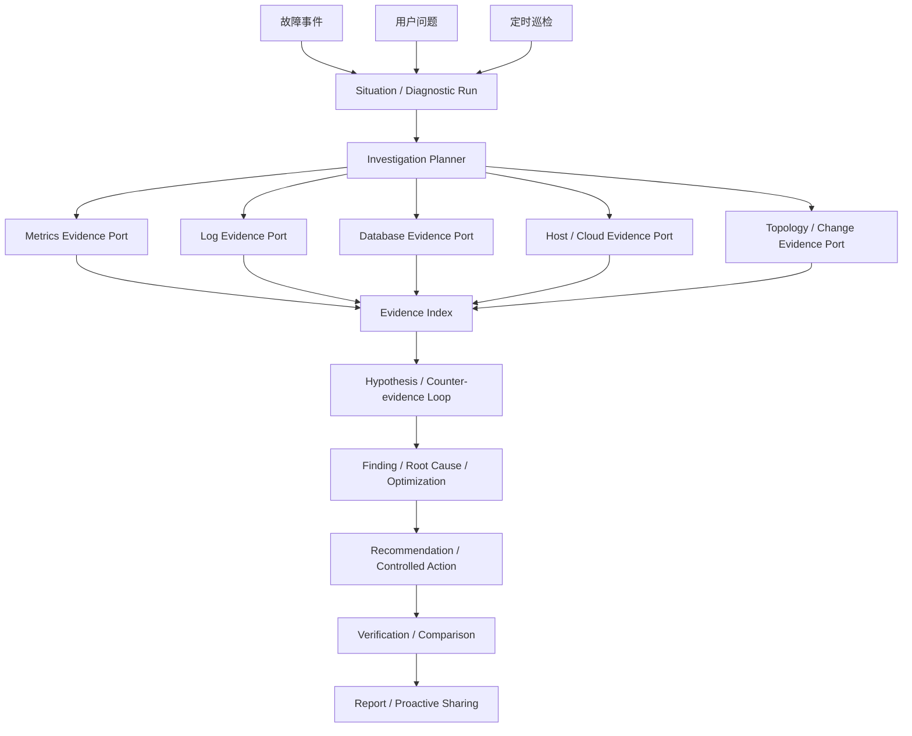

# AIOps Agent

## 目标架构原则

AIOps Agent 的架构中心是数据库诊断，不是某一种监控产品。Oracle、MySQL、
PostgreSQL 及后续数据库是核心托管目标；Prometheus、Zabbix、OEM、日志平台、
数据库连接、主机与云平台通过端口提供诊断证据。任何外部工具都不得成为诊断领域
模型的强制依赖。

故障事件、用户问题和定时巡检统一创建 `DiagnosticRun`，并共用调查、取证、假设、
结论、建议、执行、验证和报告链路。目标态逻辑结构如下：



端口按能力拆分，不使用单一 Monitor Provider 同时承载事件、指标、日志和操作：

```text
EventSourcePort
MetricsEvidencePort
LogEvidencePort
DatabaseEvidencePort
HostEvidencePort
TopologyEvidencePort
ChangeEvidencePort
SourceActionPort
NotificationPort
```

一个 Adapter 可以实现多个端口。例如 OEM 可以提供 Event、Metrics 和 Topology，
Zabbix 可以提供 Event、Metrics 和 Host Evidence，Prometheus 提供 Metrics 并通过
Alertmanager 产生 Event，Loki 只提供 Log Evidence。Target 通过 Capability 驱动的
Binding 选择实际数据源，诊断内核不根据产品名称分支。

当前代码已交付分能力 Diagnostic Source SPI、Oracle/MySQL/PostgreSQL Target 契约，
以及基于 Target 和规范事件类别的确定性 Situation 关联。跨产品事件类别必须由
Binding 的 `event_class_map` 显式映射，不使用告警文本猜测。Loki `log.query` 已通过
精确标签、时间窗、条数和字节预算进入统一 Evidence Index。轻量 Compose已提供
Prometheus、Alertmanager、Loki、Alloy、可选 Exporter 和固定镜像清单；Oracle日志
由独立 Collector查询 `V$DIAG_ALERT_EXT`、持久化 JSONL并通过 Alloy写入 Loki，
不假设 Oracle Exporter具备日志输出能力。真实数据库部署验证以及主机、拓扑、变更
和外部主动分享 Adapter仍需后续交付。Portal站内主动分享已通过 AIOps 自有的
`KBOT_OPS_NOTIFICATION_SUBSCRIPTION` 保存 Target 订阅，并在 Situation建立、自动
诊断启动、报告生成和 Situation恢复时写入共享 Notification Outbox；订阅身份只能
来自可信 AuthContext，事件中不携带原始告警、日志、SQL或凭据。
完整产品目标、领域对象和能力矩阵见
[`docs/product/aiops-agent.md`](../product/aiops-agent.md)，观测组件及其部署边界见
[AIOps 观测工具选型与 Docker Compose 部署基线](../proposals/aiops-observability-tooling-and-compose.md)。

## 服务边界

AIOps Agent 是独立领域服务，当前面向 Oracle、MySQL 和 PostgreSQL 的监控、故障与性能诊断。
它拥有 `KBOT_OPS_*` 表、状态机、调度器、Worker 和 DB Executor，不把运维流程
塞入通用 Agent Runtime。Prometheus、Alertmanager、Zabbix 和 OEM 通过 AIOps
自有的分能力 Adapter 适配；后续监控或数据库类型继续通过 Capability 和版本注册协议扩展。

## 触发与闭环

入口包括用户聊天、监控告警和定期巡检。统一闭环为：

```text
Trigger → Observe → Diagnose → Evidence Assessment → Advisory
        → Approval → Execute → Verify → Report / Comparison
```

自动告警和巡检只能使用已配置的数据源；证据不足时生成不确定结论和后续建议，
不会等待用户。聊天场景可进入多轮 HITL：当数据库不可直连且监控证据不足时，
Agent 给出受控只读 SQL，用户手工执行并粘贴结果，系统持续补证直到形成根因判断
或达到预算。

日志 Binding 使用统一定位结构，不允许传入任意 LogQL：

```json
{
  "source_locator_key": "oracle-dev-01-alert-log",
  "source_locator": {
    "labels": {
      "job": "oracle-alert",
      "instance": "oracle-dev-01"
    }
  },
  "query_budget": {
    "max_log_entries": 200,
    "max_log_response_bytes": 1048576
  }
}
```

Loki Adapter 根据这些精确标签生成查询，并对日志行、标签和结构化字段执行限长与
通用凭据脱敏。KBot 仅固化本次诊断使用的有限片段，不复制完整日志仓库。

## 监控与数据库诊断

监控采集保存来源、时间窗、单位和质量标记。数据库直连查询不允许模型生成任意
SQL：LLM 只能选择版本化诊断工具和参数，DB Executor 根据数据库方言使用预审计
模板，执行只读、超时、行数和敏感字段限制。Oracle/MySQL 支持版本化只读诊断、
受控人工 SQL 和审批后变更；PostgreSQL 已进入公开 Target 契约并支持版本化只读
诊断。Target 创建或连接配置变更后立即探测连通性，凭据只保存统一托管凭据引用。

## 配置资源生命周期与连通性

Target 和 Diagnostic Source 的人工管理状态统一为 `ENABLED`、`DISABLED`，不使用
“维护中”表示未启用或连接失败。连通性独立使用 `UNKNOWN`、`CHECKING`、
`CONNECTED`、`DEGRADED`、`UNREACHABLE`；Target 从监控证据归并出的业务观测状态
另行使用 `UNKNOWN`、`UP`、`DOWN`、`DEGRADED`。新建资源默认停用并立即写入持久化
连通性检查请求，连接配置发生变化时也会自动停用并重新检查。只有最近两小时内
成功连接的资源允许人工启用。

Scheduler 默认每小时重新检查 Target 和 Diagnostic Source，并加入最多十分钟抖动；
实际网络调用由 Worker 消费 Outbox 执行。周期失败只更新连通性，不改变人工启用
意图。Run 只接受已启用 Target；数据库不可连接时跳过直连能力并记录 Evidence Gap，
仍可继续消费已启用且可连接的监控源。Target 的 `db.availability` 观测只更新业务
观测状态，不能覆盖数据库直连状态。

## 建议、审批与执行

分析结果可以只给解决思路，也可以生成版本化 Change Proposal。每条命令必须单独
获得一次人工批准并留痕；批准绑定 Proposal Hash、Target 版本、参数、策略和过期
时间。配置允许 Agent 执行时，DB Executor 仍是最终校验点。多命令方案严格串行，
上一条执行并验证成功后才生成下一条待审命令。

用户也可选择自行执行并回填结果。无论自动或人工处理，系统都保留 Before/After
指标，生成验证结论和对比报告。

## 巡检与报告

Inspection Plan 支持日报、周报和 Cron。Scheduler 生成不可变 Fire，并按 Target
展开 Run。报告保存在系统中供前端渲染，包括诊断报告、巡检报告、处理结果和前后
对比报告。

站内主动分享采用独立订阅资源，使用强 ETag 控制更新，并按最低严重级别过滤四类
阶段事件。事件和业务状态在同一个 UoW 内写入平台 Notification Outbox，再由平台
投影到用户 Inbox。无订阅者时自动告警 Run 不向 `system:signal-intake` 创建无意义
用户通知。Email、IM、ITSM、静默、升级和值班路由当前不实现；未来接入不改变
Situation、Run、Report 和审批模型。

精确 API 以 `docs/openapi/aiops_*.json` 为准，表结构以
`database/oracle/aiops_agent/` 为准。
