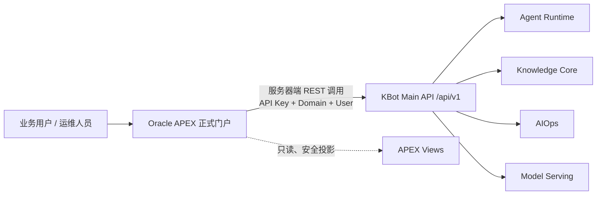

# KBot 4.0 正式 APEX 应用页面与交互蓝图

> Web、独立 App 和 Portal/BFF 接入现有登录、Token、刷新、App 权限与 Agent 可见性时，
> 统一遵循 [KBot 前端 SSO、Token 与权限接入手册](sso-permission-integration-handbook.md)。

## 1. 定位与边界

本应用是 KBot 4.0 的正式业务门户，采用 **Oracle APEX 全量开发**。它不是
`tools/dev_console` 的替代品：后者仅用于开发者联调 API；正式门户面向知识运营、
业务用户和 AIOps 操作人员。

页面由用户任务组织，不能按微服务、Python 包或数据库表直接拆页。采用以下开发
主规则：**已有 Main API 的能力优先调用 `/api/v1/*`；尚无 API 的普通管理数据，
由 APEX 直接基于表或安全视图实现查询和 CRUD。** 任何实现都禁止调用
`/internal/v1/*`。直接表 CRUD 不得展示 Secret、Prompt、原始 Evidence、内部异常、
租约信息或模型思维链。



### 1.1 身份、Domain 与权限

- APEX 认证负责识别当前用户。**用户标识统一使用 APEX 内置替换值
  `APP_USER`**：SQL/PLSQL/Process 中使用 `:APP_USER`，页面文本、按钮标签和
  组件属性中使用 `&APP_USER.`。它作为 Main API 的 `X-KBot-User-ID`，也用于
  APEX 直表 CRUD 的 `CREATED_BY`、`UPDATED_BY` 等审计字段；不得另建可被页面篡改的
  `Pxx_USER_ID`。
- `domain_id` 由登录后的受控应用上下文派生，例如受保护 Application Item
  `G_KBOT_DOMAIN_ID` 或数据库 `SYS_CONTEXT`；绝不能由页面 URL、隐藏项或浏览器传入。
- **应用标识统一使用 APEX 内置值 `:APP_ID`**（页面组件中为 `&APP_ID.`，
  JavaScript 中为 `apex.env.APP_ID`）。KBot 的 `configuration/kbot.toml` 中
  `app_id`、所有 `KBOT_*` 数据行的
  `APP_ID` 与实际 APEX Application ID 必须统一；APEX 直表/直视图查询使用
  `APP_ID = :APP_ID`。Main API 仍从服务端配置取得 `app_id`，不接收浏览器提交的
  App ID。当前 `kbot.toml` 的 `app_id = 1` 仅是 APEX 尚未开发时的临时占位值；
  创建正式 APEX 应用并确定 Application ID 后，必须将 KBot 配置及初始化/迁移数据
  一并替换为该实际编号。
- APEX 用户必须通过 Main API 登录/换票取得绑定 App、Domain 和用户的 BUSINESS Token。
  不得保存配置型 Portal Key，也不得提交 `X-KBot-Domain-ID` 或 `X-KBot-User-ID`。
- 4.0 当前后端已强制 Domain 隔离，但尚未实现通用 Role/Scope/资源 ACL。因此 APEX
  的授权方案用于控制页面与按钮可见性（普通用户、知识运营、AIOps 操作、审批人、
  平台管理员），不能替代后端的 Domain 校验；后续后端加入 Scope 后再做双端校验。
- 当前公开接口只有创建 Domain，没有“Domain 列表/切换”接口。首期将 Domain 固定为
  APEX 登录用户所属 Domain；跨 Domain 管理必须等待服务端补充受控查询接口。

### 1.2 APEX 实现原则

| 需求 | APEX 正式实现 |
| --- | --- |
| 查询列表/详情 | REST Data Source 或受控 APEX Process；报表使用 Interactive Report、Faceted Search、Cards、Modal Drawer。 |
| 新建/修改 | 有 API 时由 APEX Server-side Process 调 Main API；无 API 的普通管理表使用 APEX Form/IG 直接 CRUD。所有异步提交显示资源 ID 与状态。 |
| 文件上传 | File Browse 暂存到 APEX Collection/临时文件 → Server-side Process 以 multipart 调用 Knowledge API；浏览器不持有 API Key。 |
| 长任务进度 | 首期用 APEX Dynamic Action 定时刷新权威状态；需要逐事件时间线时增加同源 SSE Gateway，由 Gateway 在服务器端附加认证与 `Last-Event-ID`。浏览器不直连跨域 KBot SSE。 |
| 并发编辑 | 按实际接口契约提交并发值：Agent 更新、HITL 回复、Proposal 审批使用请求体中的 `expected_row_version`；Target/Inspection Plan PATCH 使用 `If-Match`；当前 Collection 状态/模型接口未提供并发参数，保存后强制重新读取。 |
| 错误处理 | 显示 Main API 的稳定错误码、用户可理解的信息和 `request_id`；不显示 Python Trace、Oracle 错误、上游模型报错或密钥。 |

### 1.3 APEX 的三条数据路径

APEX 的优势是能在同一 Oracle Schema 内高效呈现列表、统计、关联报表。因此不为
每一张报表强行补查询 API；页面按以下优先级选择数据路径：

| 判定 | APEX 实现 | 适用范围 |
| --- | --- | --- |
| 已有对应 API | REST Data Source / APEX Process 调用 Main API | API 的查询、创建、修改、状态变化、上传、审批、取消均走 API。 |
| 没有 API，且是普通管理数据 | APEX Form、Interactive Grid 或报表直接读写指定表；列表复杂时建立安全视图 | 例如后续的模型管理、静态字典或纯配置维护。表单须有审计字段、ROW_VERSION 与 Domain 过滤。 |
| 没有 API，但属于状态机或敏感领域 | 先补命令 API，不做直写 | Run、Task、HITL、Proposal、Approval、Execution、上传/解析状态、Secret、Webhook Key 等仍不能绕过领域服务。 |

因此，“没有查询接口”不构成阻碍：APEX 可直接从表或视图展示数据；只有“直接写入
会绕过业务状态机或安全边界”时，才需要先增加 API。

当前已存在的 AIOps 列表视图包括：`KBOT_V_OPS_TARGET`、
`KBOT_V_OPS_MONITOR_SOURCE`、`KBOT_V_OPS_POLICY`、
`KBOT_V_OPS_INSPECTION_PLAN`、`KBOT_V_OPS_INSPECTION_FIRE`、
`KBOT_V_OPS_RUN`、`KBOT_V_OPS_PENDING_APPROVAL` 和 `KBOT_V_OPS_REPORT`。
这些视图把 `RAW(16)` 标识转换成标准 UUID 字符串，
并从根资源透出 `APP_ID`、`DOMAIN_ID`，供 APEX 过滤与关联。

`KBOT_V_OPS_CHAT_PENDING` 当前还包含 `PROMPT_TEXT`，不应作为通用列表或工作台的
直接数据源；它需要先改为不含正文的安全包装视图（只保留 HITL ID、类型、指派人、
时间和状态），或由页面直接使用 HITL API 读取授权详情。

**安全前置条件：**现有视图暴露了 `APP_ID`、`DOMAIN_ID`。`APP_ID` 固定使用当前
APEX 应用的 `:APP_ID`，`DOMAIN_ID` 由登录后的受信 Session Context 派生；两者均
不能使用 URL/隐藏页项。直接表 CRUD 时，
APEX Parsing Schema 只授予被批准的表/列权限，并通过页面条件、授权方案与数据库
行级策略（或基于 `SYS_CONTEXT` 的安全包装视图）共同限制 Domain。待补证列表还必须
追加当前 `ASSIGNEE_USER_ID` 过滤。对只读投影，部署账号仅授予视图 `SELECT`，不授予
基表权限；对允许直接维护的表，单独最小化授予 `SELECT/INSERT/UPDATE/DELETE`。

现有 `KBOT_V_OPS_*` 及 `KBOT_V_PLATFORM_DOMAIN` 只投影 `APP_ID`、`DOMAIN_ID`，
本身尚未将 APEX Session Context 写入视图定义。因此，**页面 `WHERE` 条件不是安全
边界**：正式部署前必须实施 VPD/RLS，或将这些视图替换为基于 `SYS_CONTEXT` 的安全
包装视图；APEX Parsing Schema 不得获得 AIOps 基表的 `SELECT` 权限。P62 若需显示
创建/更新人，`KBOT_V_PLATFORM_DOMAIN` 还需补充 `CREATED_BY`、`UPDATED_BY` 的安全投影。

### 1.4 后端契约与 APEX 运行规范

页面设计以当前 Main API 契约为准。每个页面在实施设计稿前必须建立“页面—API
契约矩阵”，至少记录方法、路径、请求/响应字段、授权方案、分页参数、幂等键、并发
字段、成功后的刷新动作，以及 `409`、`412`、`422`、`428`、`503` 的用户提示。矩阵是
页面验收依据，不得仅以“已有 API”替代具体契约。

| 类别 | 当前契约 | APEX 统一行为 |
| --- | --- | --- |
| 身份与调用 | 用户登录/Exchange 获得绑定 App、Domain 和用户的 BUSINESS Token | APEX 会话服务端保存并刷新 Token；不得提交可信身份 Header，也不得用 App API Key 模拟用户。 |
| 幂等命令 | 创建 Turn/Run、上传、AIOps 创建与状态命令要求 `Idempotency-Key` | 首次点击生成 UUID；网络重试、刷新后的恢复提交沿用同一键，成功或明确失败后才生成新键。 |
| 请求体版本 | Conversation 删除/更新、Agent 更新、Agent Run 取消、HITL 回复、Proposal 审批/拒绝/人工结果使用 `expected_row_version` | 读取详情后保存版本；冲突时保留用户输入、重读权威详情并由用户决定是否重新提交。 |
| ETag 版本 | Target、监控源、各类 Binding、巡检计划及其命令、AIOps Run 取消、HITL 跳过使用 `If-Match: "rv-<row_version>"` | 详情 GET/命令响应中的 ETag 是唯一并发值来源；未获得 ETag 时禁用修改命令，不自行构造版本。 |
| 无并发版本 | Collection 状态与模型更新暂未提供 `row_version`/ETag | 保存后必须重新读取详情；禁止在页面伪造乐观锁。 |
| 错误 | Main API 使用 `application/problem+json`，包含稳定 `code`、`detail`、`request_id` | 统一 Error Handler 提示可行动信息与 `request_id`；不依赖 FastAPI 默认错误结构，也不展示上游细节。 |
| 长任务 | Run 的 SSE 用 `Last-Event-ID` 恢复；最终结果由 Result 资源提供 | 首期轮询权威详情，页面可见时才刷新，终态立即停止；SSE 仅能经同源 Gateway 使用，不能从事件片段拼最终结果。 |

上传与临时状态还须遵循以下约束：对话图片目前限 1–8 张、单张不超过 16 MiB、合计
不超过 32 MiB，且仅接受 PNG/JPEG/WebP；APEX Collection/临时文件必须在成功、失败、
取消及会话超时后清理。知识入库的 multipart 请求缺少 `Idempotency-Key` 时会被拒绝，
页面应在接收 `bundle_id`/`status_url` 后轮询 Bundle，而不是依据上传完成即宣告入库完成。

对话、Run、报告与 HITL 返回的 JSON 只能按明确白名单渲染。Markdown 必须净化；
`storage_uri`、Artifact `provenance`、原始 Evidence、内部错误和模型思维链不得显示。
`command_preview`、HITL `raw_output`、人工结果 `bounded_output` 按 APEX 授权方案、
Target 环境及安全级别决定脱敏、复制与导出，默认不提供下载。

## 2. 信息架构

一级导航以使用频率排序：**工作台、智能助手、知识中心、AIOps、平台配置、开发支持**。
APEX 中以 Navigation Menu 实现；AIOps 与平台配置按授权方案隐藏。

| 模块 | 页面编号建议 | 页面 | 核心目标 | 后端现状 |
| --- | ---: | --- | --- | --- |
| 工作台 | 10 | 我的工作台 | 查看本人待办、最近会话、运行中任务、待审批和最新报告 | 优先组合安全视图；必要时再补聚合 API |
| 智能助手 | 20 | 会话列表 | 新建、重命名、归档、删除会话；首期仅在已加载结果中按 Agent/状态筛选 | 已有会话 CRUD；服务端搜索/分页待补 |
| 智能助手 | 21 | 对话工作区 | 文本/多图片提问、流式进度、最终回答、引用、待办卡 | 已有 Turn、multipart、Run/SSE/Result |
| 智能助手 | 22 | Run 详情/轨迹 | 查看公开执行摘要、任务时间线、结果和取消操作 | 已有 Run、Events、Result、Trace |
| 智能助手 | 30 | Agent 管理 | Agent 列表、创建、编辑、启停与知识库绑定入口 | 已有 Agent CRUD、Binding API |
| 知识中心 | 40 | Collection 列表 | 首期展示基础配置；后续展示健康、文档规模和绑定 Agent 概览 | 已有 Collection 列表；运营聚合字段待补 API/View |
| 知识中心 | 41 | Collection 详情 | 查看配置、启停、模型绑定、入库记录及处理状态 | 已有详情/状态/模型/Bundle API |
| 知识中心 | 42 | 文件入库向导 | 上传普通文件或 KM Asset，选择目标集合，提交后跟踪 Bundle | 已有 user-files、km-assets、Bundle API |
| 知识中心 | 43 | 入库审批 | 对需要人工确认的 Revision 批准/驳回 | 已有 approvals/review API |
| AIOps | 50 | 智能诊断 | 选 Agent 发起持续对话，在同一时间线中查看流式结论、引用、补证和审批 | 已有 Conversation、Ops Run、SSE、HITL 与 Proposal API，需统一投影 |
| AIOps | 51 | 告警诊断 | 查看告警自动诊断结果，并从该证据上下文继续人工对话 | 已有 Situation 与 Alert Run API，需建立 Conversation 来源关联 |
| AIOps | 52 | 日常巡检 | 查看 Inspection Fire 与报告，并从异常 Finding 继续人工对话 | 已有 Inspection Fire、Report API，需建立 Conversation 来源关联 |
| AIOps | 55 | Target 管理 | 创建、编辑、启用、维护、停用 Target；管理 Agent/监控绑定 | 已有 Target 与 Binding API |
| AIOps | 56 | 监控源管理 | 创建/编辑监控源、健康检查、轮换 Webhook Key、启停 | 已有 Monitor Source API |
| AIOps | 57 | Policy 管理 | 查看、创建、激活和退休不可变 Policy 版本 | 已有 Policy API；无 PATCH 编辑契约 |
| AIOps | 58 | 巡检计划与异常 | 管理计划和范围，查看 Inspection Fire | 已有 Inspection Plan/Fire API |
| AIOps | 59 | 报告中心 | 查看报告、版本与安全摘要 | 已有 Report/Version API |
| 平台配置 | 60 | 模型配置 | 管理员配置 LLM/向量/VLM 等模型，供 Agent/Collection 表单选择 | APEX 直接 CRUD `KBOT_AI_MODEL` |
| 平台配置 | 61 | KBot 连接配置 | 配置 APEX 调用 Main API 的协议、Host、端口、Portal 明文 API Key，并测试连通性 | 新建 APEX 配置表，直接 CRUD |
| 平台配置 | 62 | Domain 管理 | 创建、查看、启用/停用 KBot 业务 Domain；作为所有业务资源的隔离范围 | 创建走 API；列表/缺失维护走视图与表 |
| 开发支持 | 90 | 开发诊断 | 查 Agent Run 与服务日志，仅开发环境开放 | 已有 development API |

## 3. 页面分组与关键交互

### 3.1 工作台（P10）

这是登录后的默认页，不做“大而全的数据大屏”。采用四组可点击 Cards：

1. **我的进行中任务**：Run 状态、最后更新时间、取消/查看入口；
2. **待我处理**：HITL、待审批 Proposal、入库审批；
3. **知识运营概况**：Collection 数量、处理中 Bundle、失败入库；
4. **AIOps 概况**：运行中诊断、异常巡检、最新报告。

Cards 的数量必须来自受控聚合 API 或安全视图，不在页面拼接多个无分页列表。首期只开放
已有安全摘要可以可靠支撑的卡片；“最近会话”“处理中 Bundle”“我的全部入库审批”等没有
聚合查询契约的指标，待补 API/View 后再进入工作台，不能用多次明细请求在 APEX 页面拼接。
点击卡片进入对应权威列表页，并保留筛选条件。

### 3.2 智能助手（P20–P22）

**P20 会话列表**首期读取最近会话（当前 API 仅支持 `limit`，最大 200），并在已加载
结果中按 Agent、更新时间和状态筛选；不将“创建人、关键词、全量 Faceted Search”
宣传为服务端检索能力。新建会话时先选择 Agent，随后创建 Conversation；重命名与归档
使用 `expected_row_version` 更新，删除也必须携带该版本并二次确认。页面不允许用户手填
`domain_id`。后续需要大规模搜索时，先补 Agent/状态/关键词筛选、排序及 cursor 分页 API，
不得为了筛选而读取跨页或跨 Domain 的会话数据。

**P21 对话工作区**采用左右布局：左侧会话树/列表，右侧消息时间线与输入区。输入区支持文本、最多允许数量内的图片预览和提交；提交后立即写入一条本地“已提交”状态，再按 Run 状态刷新。消息只能渲染以下安全内容：Markdown、结构化表格、引用卡、图片缩略图、报告卡、HITL 卡、审批卡和只读图表 JSON。不得渲染任意 HTML 或执行模型返回的 JavaScript。文档引用卡点击后，以 `run_id + citation_label` 调用引用预览描述接口；PDF 打开源文件并跳到 `page_no`，图片和纯文本打开源文件，其他格式只提供下载。前端不得提交或拼装 Collection、Bundle、Document 等内部定位主键，也不再把 Chunk 正文作为文档预览。

**P22 Run 详情**是所有长任务的通用查看页。展示公开状态、时间线、引用和最终结果；终态后读取 Result，不从 SSE 事件片段拼接最终答案。取消必须调用 Run cancel API，并显示“取消请求已受理”，不能直接假设已停止。

设计依据：Run/Task/Event 是可恢复的执行模型，SSE 仅传递公开进度，最终正文由 Result 资源返回；子 AIOps 事件在 Root Run 中以投影形式展示，不能把两条 SSE 直接拼接。

### 3.3 Agent 与知识中心（P30、P40–P43）

**P30 Agent 管理**使用 Interactive Report + Modal Form。表单包含名称、说明、能力、指令摘要及模型选择；模型 LOV 只读取 `GET /api/v1/model-catalog` 中状态为启用的模型，并按类别过滤。保存后可进入“知识库绑定”子区域，显示已绑定 Collection，提供绑定和解绑。模型密钥和 Provider 配置不在本页面展示或编辑。当前 Agent API 没有物理删除接口；“启停”通过带
`expected_row_version` 的 `PATCH` 将状态设为 `DRAFT`、`ACTIVE` 或 `INACTIVE`，页面不提供删除按钮。当前 Agent 列表也未提供服务端分页/筛选，规模化管理前需补查询契约。

Agent、知识库与对话构成一条关联线路，但不是所有 Agent 都必须绑定 Collection：

```text
创建/入库 Collection → Collection 状态为 ACTIVE → 绑定到 Agent
→ 激活具备 document 能力的 Agent → 创建会话/提交问题 → 检索已绑定 Collection
```

运行时的 `KnowledgeRetrievalSkill` 会按 Agent 查询有效 Binding；没有有效 Binding 时，
文档检索返回“当前 Agent 没有可用的 Collection 绑定”和
`INSUFFICIENT_EVIDENCE`，而不是自动检索同 Domain 的全部知识库。当前代码并不阻止
创建会话或执行只具备 `conversation`、`mcp_data`、`aiops` 能力的 Agent。

正式 APEX 页面按下列规则控制。该规则目前是门户层的产品约束，后端代码尚未在
Agent 激活时强制校验 Binding；后续可补后端校验以形成双重保护：

| Agent 能力 | 是否要求 Collection Binding | 页面行为 |
| --- | --- | --- |
| 包含 `document` | 要求至少一个 ACTIVE Binding 后才能从 DRAFT 激活 | 无绑定时显示“请先绑定知识库”，禁用“激活”按钮；已激活但绑定被撤销时，对话页提示文档检索不可用。 |
| 仅 `conversation` / `mcp_data` / `aiops` | 不要求 | 可直接激活和使用；它们不应把未绑定知识库误报为系统故障。 |

该规则让“问文 Agent 必须先绑定 Collection”成为清晰的产品流程，同时保留普通对话、问数和 AIOps Agent 的独立使用能力。

**P40 Collection 列表**首期只展示现有列表 API 返回的名称、状态、模型、说明与安全级别；
“入库健康、最后入库时间、文档规模、绑定 Agent 数量”必须在补充聚合 API 或安全视图后
才展示，不得在页面对无分页明细做 N+1 拼接。**P41 Collection 详情**使用页签：概览、
模型与检索配置、入库批次、Agent 绑定、审批。状态变更与模型更新是独立 API；当前
Collection 状态和模型接口未暴露 `row_version`/ETag 条件，页面保存后必须重新读取权威详情，
不能伪造并发控制。

**P42 文件入库向导**分三步：

1. 选择 Collection，确认知识范围和允许的文件类型；
2. 选择“普通文件”或“KM Asset”，上传/填写资产标识及补充说明；
3. 提交后进入 Bundle 状态页，显示接收、解析、索引、完成/失败状态。

失败时只显示可行动的安全原因与 `request_id`；解析器内部日志、对象存储路径和模型目录不对业务用户暴露。**P43 入库审批**首期仅在指定 Collection 中处理 API 返回的待审 Revision，审批后刷新 Bundle/Member 状态；“我的全部入库审批”需要新增聚合 API 或安全视图后才能进入 P10 待办卡。

### 3.4 AIOps 三入口工作区（P50–P52）

**P50 智能诊断**先选择已启用 Agent，再进入持续 Conversation。Target 和监控源来自
Agent 的有效绑定，页面不要求用户填写 Target ID、Source ID 或 JSON。消息时间线统一
展示用户输入、Agent 进度、流式 Markdown 结论、引用、报告和待审批动作；刷新页面后以
Conversation 和 Run Result 恢复权威内容，不能只依赖浏览器中收到的 SSE 片段。
每条用户消息建立独立 `conversation_turn_id`，进度、正文、表格、图表、引用和错误都
必须归属到该 Turn；历史证据只有经服务端显式关联后才能在本轮使用。
聊天正文直接回应本轮问题，不固定输出“根因等级、已验证事实、立即建议、长期建议”等
报告章节。前端按服务端 `answer.markdown`、`answer.table`、`answer.chart` 和
`evidence.references` 等白名单块渲染；不得扫描 Conversation 或 Run 的全部 Facts，
也不得根据字段名称自行决定展示表空间等图表。引用证据进入默认折叠的“诊断依据”，
交互方式与 KM 引用一致，用户需要核查时再展开。详细契约见
[AIOps Agent 专业 DBA 对话诊断设计](../product/aiops-agent-chat-diagnosis.md)。

流式进度使用“正在确认实例”“正在查询最近15分钟SQL统计”等用户可理解的专业动作，
不展示 Investigation Round、Evidence Index 或内部 Tool ID。回答生成失败时保留已经
完成的同一 Turn 内容，并显示可行动的错误边界，不得用其他历史事实填充当前回答。

当证据不足时，Agent 在普通消息中解释缺口并给出补证办法或经过校验的只读 SQL。
用户继续使用同一个输入框粘贴文字、SQL 客户端输出或上传截图，系统将其登记为
`USER_PROVIDED` Evidence 并恢复原 Run。页面不显示“补证卡片”、内部 HITL 表单或
`hitl_id`；也不能把聊天中的“同意”解释为变更批准。

**P51 告警诊断**以 Situation 为主线，展示信号时间线、自动只读诊断、可折叠诊断依据、
建议和恢复状态。自动诊断不执行变更。用户点击“继续深入诊断”后创建带
`source_situation_id/source_run_id` 的 Conversation，首轮上下文由服务端从原 Run 的
不可变证据和结果中构造，浏览器不得复制或伪造隐藏 Prompt。此后的人工 Chat Run 才能
按 Agent 权限生成逐条审批的变更提案。

**P52 日常巡检**以 Inspection Fire 和报告为主线，展示计划、Target、异常 Finding、
趋势、建议和执行状态。点击“继续分析”创建带 `source_run_id/source_report_id` 的
Conversation，并复用巡检的时间窗口、证据和报告结论。后续对话、补证、审批和验证与
智能诊断共用同一组件和契约。

Run、Report、Proposal 不再设置面向业务用户的一级列表入口。它们作为三个工作区中的
详情、结果和待办出现；运维目标、诊断源、Agent、巡检计划等管理对象仍保留在资源配置。

内嵌的**变更审批**采用四步确认：

1. 目标、环境、影响对象与风险；
2. 前置条件、已验证证据、回滚与验证计划；
3. 精确的受控动作摘要及 Proposal Hash/版本；
4. 填写备注后批准、拒绝或记录人工处理结果。

审批不能批量操作，不能由聊天文本触发；前端不得得到 Approval Token 或 Mutation Grant。只有服务端已登记的 Action Template 才可走审批，不能出现通用 SQL/DML 编辑器。

批准请求必须提交 `expected_row_version` 与当前 `proposal_hash`；拒绝和记录人工结果也必须
提交当前版本，并使用独立幂等键。批准成功仅表示服务端已创建执行授权与 Execution，页面
不得显示或保存返回的 Approval Token，也不得将“已批准”等同于“已执行”。

**资源配置页面**使用“列表 → 详情抽屉/表单 → 受控 API 保存”模式：

- Target 只允许启用、维护、停用，不提供物理删除；
- 监控源健康检查异步进行，页面显示最近检查结果；Webhook Key 轮换后只显示一次，并且不写入 APEX 页面项、调试日志或报表；
- Target 的 Agent Binding 与 Monitor Binding 分为两个页签，命令采用明确按钮（activate/disable/maintenance），不将命令名直接作为自由文本；
- 巡检计划默认暂停，只有计划、目标范围和调度校验通过才允许启用；Inspection Fire 仅展示审计摘要与跳转。

Policy 没有 `PATCH` 编辑接口，是不可变的版本资源：修改规则时新建 Policy，校验后激活
新版本，并在需要时更新 Target Agent Binding 的 `policy_id`；旧版本通过 `retire` 命令
退出使用。所有上述状态命令均要求 ETag 与幂等键。

报告正文和版本比较由告警诊断或日常巡检的上下文入口打开，证据和下载链接必须按
Main API 的 Domain 授权后再展示，不再提供脱离业务上下文的一级“报告中心”。

### 3.5 平台与开发支持（P60、P61、P62、P90）

**P60 模型配置**是平台管理员维护模型资源池的 APEX 页面，直接 CRUD
`KBOT_AI_MODEL`，重点支持 LLM 配置，同时覆盖文本向量、图片向量和 VLM。
它也是 P30 Agent 与 P41 Collection 表单的模型 LOV 来源。

- **列表区**：Interactive Report 展示类别、状态、显示名、`served_model_name`、
  Provider、Provider 模型名、Endpoint、参数中的向量维度和“密钥已配置”标记；绝不在列表、
  导出或调试信息中展示 `API_KEY`。
- **新增/编辑弹窗**：公共字段为显示名、服务模型名、类别、Provider、Provider 模型名、
  Endpoint、状态、参数 JSON、说明；LLM 类别默认展示 Provider/Endpoint/密钥/参数，
  向量类别在参数 JSON 中填写必填的 `embedding_dimension`。
- **数据校验**：`served_model_name` 必须符合小写技术名规则且全局唯一；类别为文本向量
  时 `MODEL_PARAMS.embedding_dimension` 必填且大于零，其他类别不得设置该参数；
  `MODEL_PARAMS` 必须是合法 JSON。
- **审计与主键**：新增时由 APEX Before Insert Process 生成兼容 UUIDv7 的
  `MODEL_ID`，`CREATED_BY`/`UPDATED_BY` 写 `:APP_USER`，时间戳由数据库默认值处理；
  编辑时不得修改 `MODEL_ID` 或 `SERVED_MODEL_NAME`。后者是模型池缓存键，变更模型
  身份应新建一条模型记录，而不是覆盖原记录。
- **密钥保护**：`API_KEY` 使用 Password Item，编辑页仅显示“已配置”；空值代表保持原
  密钥，只有明确选择“清除密钥”才写入 NULL。模型其他字段可直接表 CRUD，但密钥更新
  应使用受控 APEX Server-side Process；Parsing Schema 不授予通用 `API_KEY` 查询权限，
  列表/导出基于不含密钥的安全视图。该页面只对“平台管理员”授权。
- **生效提示**：保存数据库记录后，页面提示“已保存，需刷新对应模型服务配置”；在未具备
  刷新 API 前，由管理员执行受控重启/刷新操作，不能假设进程自动加载新 Endpoint、密钥
  或启停状态。

P60 的直接 CRUD 还依赖三项新增数据库对象/约束：

1. `KBOT_V_AI_MODEL_ADMIN`：仅投影非敏感模型列和“密钥是否已配置”标记，供列表、
   LOV 和导出使用；现有 `KBOT_AI_MODEL` DDL 尚未提供该视图。
2. 兼容 Python `platform_core.identity.uuid7()` 的 Oracle 函数或受控 PL/SQL 包，供
   APEX 新增模型生成 `MODEL_ID`；现有 Oracle DDL 尚未提供 UUIDv7 生成函数。
3. 并发策略：现有 `KBOT_AI_MODEL` 没有 `ROW_VERSION`。首期更新须以原始
   `UPDATED_AT` 作为更新条件并在 0 行更新时提示冲突；后续建议增加 `ROW_VERSION`
   列，统一直接 CRUD 的乐观锁行为。

**P61 KBot 连接配置**管理的是 APEX 到 KBot Main API 的连接地址，不是某个 LLM
Provider 的 Endpoint。它避免将 `http://host:port` 写死在每个 APEX REST Data Source、
Process 或 JavaScript 文件中。建议直接 CRUD 一张 APEX 自有配置表
`KBOT_APEX_PLATFORM_CONFIG`，每个环境仅允许一个 `ACTIVE` 记录。该表目前不在 KBot
4.0 Oracle DDL 中，实施 P61 前需先建立其 DDL、唯一约束和最小权限。

| 配置项 | 说明 |
| --- | --- |
| `CONFIG_KEY` / `DISPLAY_NAME` | 稳定配置标识和管理员可读名称，例如 `kbot-main-api`。 |
| `PROTOCOL` | `https` 或开发环境的 `http`。生产环境强制 `https`。 |
| `HOST` | KBot Main API 的 DNS 名称或 IP，不包含协议、端口、路径或 URL 参数。 |
| `PORT` | Main API 监听端口，例如本地开发的 `18099`；限制为 1–65535。 |
| `STATUS` | `ACTIVE` / `DISABLED`；只有 Active 配置可被 APEX REST 调用读取。 |
| `AUTH_MODE` | 固定为 Main API 用户登录/换票，不允许配置静态 Portal Key。 |
| 审计字段 | `CREATED_BY`、`UPDATED_BY` 使用 `:APP_USER`，并保留时间戳。 |

页面提供“测试连接”按钮：由 APEX **服务器端**根据当前表单值调用
`{protocol}://{host}:{port}/readyz`，只返回连通性、HTTP 状态、耗时和 `request_id`；
不得从浏览器直接探测内网地址。保存后，由一个公共 PL/SQL 包/应用计算返回完整 Base
URL，所有 REST Data Source 和 APEX Process 统一读取它；业务代码固定拼接 `/api/v1`，
健康检查固定使用 `/readyz`，不作为页面配置项。

APEX 会话在服务端保存用户 BUSINESS Token，并在过期前调用 `/api/v1/auth/refresh`。
第三方机器集成应在目标 App 的“API 客户端”页单独创建，不与 APEX 用户会话混用。
连接测试只验证网络可达；认证测试使用当前用户 Token 区分 `401/403` 与上游服务故障。

安全限制：仅平台管理员能维护；生产环境拒绝 `localhost`、`127.0.0.1`、私网以外的
任意未登记 Host、非 HTTPS 和携带路径/查询串的 Host；页面不提供任何内部微服务
Host/Port 配置，APEX 始终只访问 Main API。模型的上游 Endpoint 仍在 P60 管理。

**P62 Domain 管理**是平台配置的起始页。Domain 不是普通标签，而是 KBot 的强制
数据隔离边界；Agent、Conversation、Collection、AIOps Target 和 Run 都在某一
Domain 内运行。页面使用 `KBOT_V_PLATFORM_DOMAIN` 展示 Domain ID、名称、状态、
说明、版本和审计时间，并以 `APP_ID` 过滤当前部署应用。

- **创建**：已有 `POST /api/v1/domains`，因此点击“新建 Domain”调用 API；名称和
  说明由 API 校验，创建人来自 `:APP_USER`。
- **列表与详情**：当前没有 Domain 查询 API，APEX 直接查询
  `KBOT_V_PLATFORM_DOMAIN`；`DOMAIN_ID` 为身份列，只读且不可手工修改。
- **维护**：当前没有更新/启停 API 时，可由平台管理员直接更新表中的名称、说明和
  `ACTIVE/DISABLED` 状态，并同步 `UPDATED_BY = :APP_USER`、`ROW_VERSION`、
  `UPDATED_AT`。名称受 `(APP_ID, NAME)` 唯一约束保护。
- **停用而非删除**：不提供删除按钮。停用后 Main API 会拒绝该 Domain 的后续请求；
  页面必须先显示受影响资源数量并二次确认。恢复时重新置为 `ACTIVE`。
- **登录映射**：Domain 创建完成后，平台管理员需在门户用户/组织映射中为用户指定
  默认 Domain；该映射由独立的管理 APEX 应用负责。KBot 门户登录后从该管理应用
  提供的受信上下文取得值并写入 `G_KBOT_DOMAIN_ID`，而不是让用户在普通页面自由切换。

**P90 开发诊断**仅在开发/联调环境并按 APEX 授权开放。它展示脱敏的 Agent Run 运行摘要和日志事件，不能用作生产审计、不能显示请求正文、凭据、SQL 或堆栈。

## 4. 页面状态与通用组件

| 组件 | 用途 | APEX 实现 |
| --- | --- | --- |
| 状态徽标 | Run、Bundle、Target、Proposal、Plan 的一致状态文案和颜色 | Shared LOV + Template Directive |
| 资源时间线 | 显示公开事件、最后事件游标和刷新时间 | Classic Report/Template Component + 定时 DA/SSE Gateway |
| 安全引用卡 | 显示来源标签、页码摘要、按 Run 授权打开源文件 | Template Component；仅携带 `run_id + citation_label`，使用 `document-preview.js`，不嵌 Chunk 或内部主键 |
| 待办卡 | HITL、审批、报告、失败入库的统一入口 | Cards Region + Authorization Scheme |
| 并发冲突提示 | 处理 `412` / 行版本冲突 | APEX Error Handler + 重读详情按钮 |
| 空态/无权态 | 避免暴露跨 Domain 资源存在性 | 统一显示“资源不存在或无访问权限” |
| 幂等提交保护 | 防止重复点击创建 Run、上传、审批 | 提交时生成 `Idempotency-Key`，按钮进入 Processing 状态 |

建议统一状态字典：`PENDING`、`RUNNING`、`WAITING_INPUT`、
`WAITING_APPROVAL`、`COMPLETED`、`FAILED`、`CANCELLED`、`EXPIRED`、
`DEGRADED`。`DEGRADED` 需同时列出缺失证据或失败分支，不能等同于成功。

## 5. APEX 直表/直视图与 API 的责任划分

| 页面/数据 | 数据入口 | 直接表 CRUD 的边界 |
| --- | --- | --- |
| 工作台、Target 健康、巡检异常、Run、待审批、报告列表 | 在 VPD/RLS 或 `SYS_CONTEXT` 安全包装视图完成后，读取对应的 `KBOT_V_OPS_*` 摘要；结合 APEX Cards/IR/IG | 只读；点击后进入 API 详情/命令页面。`KBOT_V_OPS_CHAT_PENDING` 在移除 `PROMPT_TEXT` 前不用于通用列表。 |
| Conversation、Agent、Collection、Bundle | 已有 Main API，优先 API | 不因同库而改成直写；创建会话、Agent/Collection 变更、绑定和上传继续走 API。 |
| 模型配置 `KBOT_AI_MODEL` | P60 直接维护非敏感字段；密钥由受控 Server-side Process 更新 | `API_KEY` 不进入普通查询、IG 或导出；保存后需触发服务配置刷新或重启，不能假设模型进程自动重载。 |
| APEX→KBot 连接配置 | P61 直接 CRUD `KBOT_APEX_PLATFORM_CONFIG`；所有 REST 调用统一读取 Active 配置 | API Key 只保存在 APEX Web Credential；连接测试只能服务器端执行。 |
| Domain `KBOT_PLATFORM_DOMAIN` | 创建使用 `POST /api/v1/domains`；列表读取 `KBOT_V_PLATFORM_DOMAIN`；当前无更新 API 的字段由 P62 直接维护表 | 不物理删除；启停必须二次确认并记录 `:APP_USER`。 |
| 后续静态字典、简单配置表 | 无 API 时可直接以 APEX Form/IG CRUD | 必须具备主键、审计列、ROW_VERSION 与 Domain/App 过滤；先定义字段白名单。 |
| Target、监控源、Policy、巡检计划 | 当前已有 API，使用 API；列表可用视图 | 即使 APEX 可见底表，也不直接改状态字段，避免绕过版本、审计与调度逻辑。 |
| Run、Task、HITL、Proposal、Approval、Execution、Report | 视图读取摘要 + API 详情/命令 | 永不直接 CRUD；这些记录受状态机、幂等、Outbox 或安全令牌保护。 |
| 文档/Version、上传/解析任务 | 视图或 API 查询安全元数据 | 永不直接改入库/解析状态；文件和审批必须调用 API。 |
| 实时进度 | 视图/Run 摘要作为定时刷新数据源 | 逐事件展示才使用同源 SSE Gateway；不把 API Key 暴露给浏览器。 |

## 6. 交付顺序

1. **门户基础**：确定正式 APEX Application ID 并同步替换临时 `app_id = 1`；完成 P61 KBot 连接配置、P62 Domain 管理、认证、接收独立管理应用提供的 Domain Session Context、Web Credential、VPD/RLS 或 `SYS_CONTEXT` 安全视图、统一错误/幂等/ETag 组件、菜单与状态组件。P10 仅先搭建具备安全摘要来源的 Cards。
2. **业务 MVP**：P60 模型配置先行，再完成 P30 Agent、P40/P41/P42 知识入库和 P20/P21/P22 对话闭环。
3. **AIOps 闭环**：P51/P52 诊断，P53 HITL，P54 审批，P55 Target 与 P59 报告。
4. **运营完整性**：P30 Agent 与 Binding、P43 入库审批、P56–P58 监控/Policy/巡检。
5. **增强项**：同源 SSE Gateway、工作台聚合 API、文档明细、受控下载、生产审计。

## 7. 设计依据

- Main API、AuthContext 和公开 API 边界：[身份与 API](../architecture/security-and-api.md)
- Agent Run、事件恢复、Result 与状态迁移：[Agent Runtime](../architecture/agent-runtime.md)
- Knowledge Core、解析入库和视觉检索：[Knowledge Core](../architecture/knowledge-core.md)
- Agent、模型和 Prompt 配置：[Model Serving](../architecture/model-serving.md)
- AIOps 交互、审批、巡检与报告：[AIOps Agent](../architecture/aiops-agent.md)
