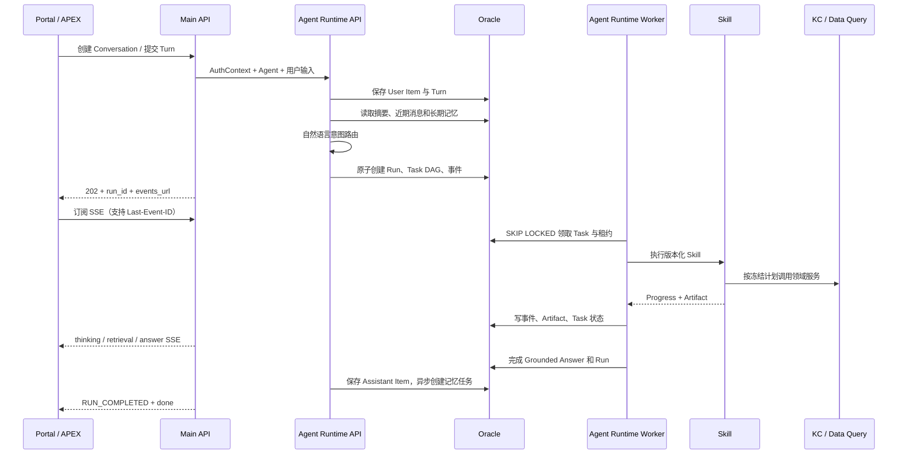

# KBot 4.0 Agent 完整聊天流程

## 一页产品概述

KBot 4.0 将聊天从“一次模型调用”升级为可恢复、可追溯的 Agent 执行流程。
Conversation 保存多轮历史和记忆，Run 保存本轮执行，Task 调用版本化 Skill，
Artifact 保存中间及最终结果，SSE 负责实时展示进度。

当前知识检索 Agent 可从通用对话、知识库问答和业务问数中选择任意非空能力组合：

| 路由 | 用户场景 | 执行能力 | 最终依据 |
| --- | --- | --- | --- |
| `CONVERSATION` | 闲聊、解释、通用问答 | 通用对话 Skill | 模型回答 |
| `DOCUMENT` | 查询文档、资产、附件 | Knowledge Core 两阶段检索 | KC Evidence |
| `DATA_QUERY` | 查询业务数据、Excel 数值 | MCP 或 Semantic Data Query | Query Result |
| `HYBRID_PARALLEL` | 文档与数据可独立求证 | 文档和问数并行 | Citation Pack + Query Result |
| `HYBRID_DOCUMENT_FIRST` | 先从文档确定口径再问数 | 文档约束问数 | Citation Pack + Query Result |
| `HYBRID_DATA_FIRST` | 先取数据再查解释依据 | 问数约束文档检索 | Query Result + Citation Pack |
| `CLARIFY` | 意图或指代不明确 | 澄清回复 | 用户后续输入 |

每轮选择一个确定路由；Hybrid 路由内部生成固定、可审计的多分支 DAG，不允许模型
生成任意 Skill 名称、URL 或 SQL。AIOps Agent 属于独立 App，使用 AIOps Run 接口
和状态机，不进入知识检索 Agent 的 Router 或 Task DAG。

## 用户请求到最终回答



公开入口从 `POST /api/v1/apps/knowledge-retrieval/conversations` 开始。提交 Turn 后返回
`run_id` 和 `/api/v1/apps/knowledge-retrieval/runs/{run_id}/events`。SSE 断线后使用
`Last-Event-ID` 续传；最终结果也可通过
`GET /api/v1/apps/knowledge-retrieval/runs/{run_id}/result` 重新获取，因此 SSE 不是状态存储。

## 会话上下文与记忆

开始新 Turn 时，Runtime 组合四类上下文：

1. Agent 指令和模型配置；
2. 当前 Conversation 的 Active Snapshot；
3. Snapshot 之后的近期原始消息；
4. 与当前问题相关的长期记忆。

Router 使用原始输入和裁剪后的 Conversation Context 判断唯一意图。进入执行
计划后，`context-rewrite` Skill 再生成独立问题：

```text
上一轮：介绍案例 A。
当前轮：它用了什么数据库？
standalone_query：案例 A 使用了什么数据库？
```

改写产物保留原始问题、补全后的问题、引用的消息/记忆和歧义状态。存在两个同等
可能对象时返回 `CLARIFY`，不会猜测。Turn 成功后，Memory Worker 异步生成摘要、
用户事实和偏好；失败不会影响已完成回答。重新打开 Conversation 时可恢复用户
消息、回答、引用、图表和公开执行轨迹。

## Root Router 与 Skill 计划

多能力 Agent 必须配置 Router LLM。模型只能在 Agent 已启用的固定路由集合中
选择，不能生成 URL、SQL、Skill 名称或任意执行计划。低于置信度阈值时进入
`CLARIFY`。

### 通用对话

```text
context-rewrite
  → conversation-response
  → GROUNDED_ANSWER（无文档引用）
```

### 文档问答

```text
context-rewrite
  → knowledge-retrieval
      → KC Discovery
      → KC Evidence Retrieval
      → CITATION_PACK
  → response-composer
  → GROUNDED_ANSWER + Reference Cards
```

回答只能引用 `CITATION_PACK` 中实际使用的 Evidence。若证据不足，返回
`INSUFFICIENT_EVIDENCE`，不能由模型补写无来源结论。

### Data Query 与 ECharts

```text
context-rewrite
  → data-query（MCP 或 Semantic）
  → QUERY_RESULT
  → [echarts，仅用户要求图表时]
  → response-composer
  → GROUNDED_ANSWER + query_result_id + visualization
```

MCP 模式调用配置的外部问数 Provider；Semantic 模式通过 Data Query 服务执行冻结的
数据源、语义模型、策略与 Agent Binding。两种模式都输出相同的 `QUERY_RESULT`
Artifact。它有独立 UUID，不伪装成文档引用；ECharts Skill 只输出安全 JSON，拒绝
函数、JavaScript URL 和原型污染字段。

### Hybrid

```text
parallel:        context-rewrite → [knowledge-retrieval || data-query] → response-composer
document-first:  context-rewrite → knowledge-retrieval → data-query → response-composer
data-first:      context-rewrite → data-query → knowledge-retrieval → response-composer
```

每个分支独立产生类型化 Artifact。串行模式把前一分支的受控约束传给后一分支；
Response Composer 只使用已完成且可追溯的 Citation Pack 或 Query Result，
不把模型推断伪装成来源事实。

## SSE 事件类型

### 执行生命周期

| 事件 | 前端用途 |
| --- | --- |
| `RUN_CREATED` | 已接受请求并创建 Run |
| `memory.context_loaded` | 已加载摘要、近期消息和相关记忆 |
| `RUN_STARTED` | 展示选中的路由、计划版本和 Task 数量 |
| `TASK_READY` | 重试或依赖满足后的 Task 可执行 |
| `TASK_STARTED` | Worker 已领取 Task |
| `skill.started` | 展示 Skill ID、版本和处理阶段 |
| `skill.progress` | 展示不含敏感内容的结构化进度 |
| `ARTIFACT_CREATED` | 中间或最终产物已持久化 |
| `TASK_COMPLETED` | 当前 Task 成功 |
| `TASK_RETRYING` / `TASK_FAILED` | 重试或失败提示 |
| `RUN_COMPLETED` / `RUN_FAILED` / `RUN_CANCELLED` | Run 终态 |
| `done` | Main API 发出的 SSE 流结束标志 |

### 用户可见语义事件

| 事件 | 关键载荷 |
| --- | --- |
| `query.rewritten` | 是否歧义、改写状态，不暴露完整内部 Prompt |
| `retrieval.completed` | 候选 Bundle 数、Citation 数、图片处理状态 |
| `data.query.completed` | `query_result_id`、列名、最多 20 行预览、截断状态 |
| `chart.completed` | `query_result_id` 和完整安全 ECharts 配置 |
| `thinking.delta` | “选择了什么能力、正在检索什么”等公开过程摘要 |
| `answer.delta` | 最终回答正文增量 |
| `answer.completed` | 回答状态和引用数量 |

`thinking.delta` 是可审计的执行说明，不是模型隐藏思维链。前端可按
`sequence_no` 去重和续传。

示例：

```text
event: data.query.completed
data: {
  "sequence_no": 12,
  "event_type": "data.query.completed",
  "payload": {
    "query_result_id": "...",
    "columns": ["MONTH", "SALES"],
    "preview_rows": [{"MONTH": "2026-07", "SALES": 120}],
    "row_count": 12
  }
}
```

## 最终回答与真实引用

最终 `GROUNDED_ANSWER` 同时保存：

- `answer`：用户可见正文；
- `status`：`READY / CLARIFICATION_REQUIRED / INSUFFICIENT_EVIDENCE`；
- `references`：实际使用的文档 Evidence 或 Query Result；
- `query_results`：完整问数结果；
- `visualizations`：ECharts 配置；
- `warnings`：截断、模型能力缺失等降级说明。

文档引用可以回到 Collection、Bundle Revision、Document Version、Evidence、
章节、页码和坐标。问数引用可以回到 Profile 和 `query_result_id`。重新打开
Conversation 时直接渲染已提交的 Assistant Item，不重新执行模型。

## 建议的 PPT 叙事

1. 从“聊天接口”到“可恢复 Agent Runtime”；
2. Conversation、Run、Task、Artifact、Event 五层模型；
3. 一张端到端时序图；
4. 单能力、三种 Hybrid 与 AIOps 委派路由；
5. 不同 Skill DAG 对比；
6. SSE 实时过程与断线续传；
7. 文档 Evidence 与 Query Result 的真实引用；
8. 多模型分工和长期记忆；
9. 安全边界：Domain、Skill Manifest、只读执行；
10. Demo：文档问答、业务问数加图表、恢复历史会话。
