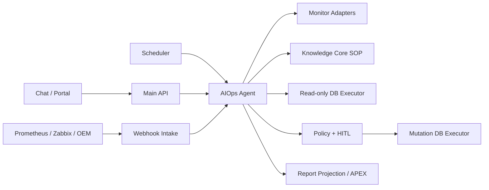
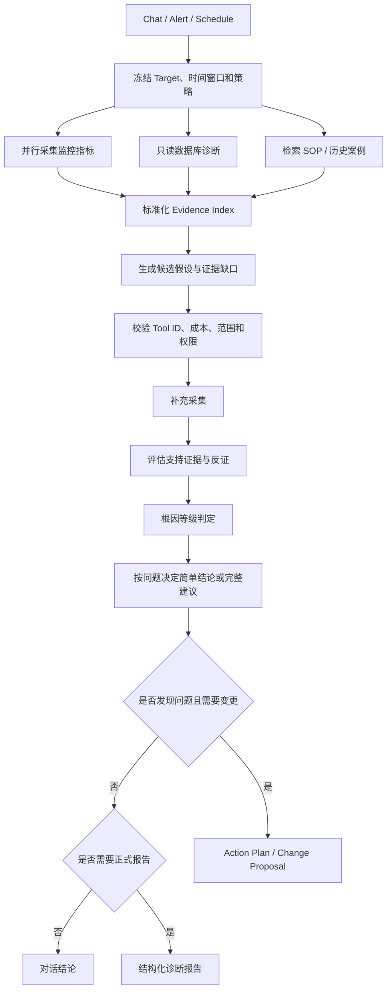
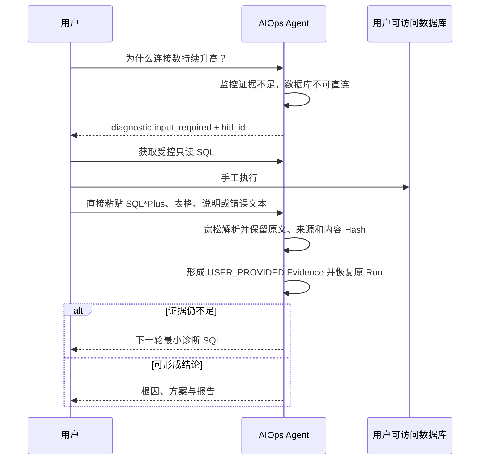

# KBot 4.0 AIOps Agent 产品能力与完整流程

## 总体设计定位

KBot AIOps 的核心目标不是建设一个新的通用监控平台，而是建设一个以数据库为
中心的主动诊断与性能优化系统。系统首先接入 Oracle、MySQL、PostgreSQL，并通过
数据库能力包继续扩展其他数据库；Prometheus、Zabbix、OEM、日志平台、主机与
云平台只是诊断证据来源，不构成诊断内核的强制依赖。

目标态覆盖三个业务入口：

1. **故障主动诊断与分享**：外部事件或 KBot 自身检测到异常后，主动创建故障情境、
   开展调查并按阶段分享事实、诊断进展和最终结论；
2. **用户发起的问题诊断**：根据用户描述确定目标、问题和时间窗口，通过多轮取证
   回答故障、性能、容量、高可用、配置等问题；
3. **日常巡检与优化**：按计划执行健康检查、风险发现、趋势分析、容量预测和性能
   优化，发现异常时复用同一条深度诊断链路。

三个入口只决定为什么启动诊断，后续统一进入：

```text
触发 → Situation → Diagnostic Run → 自适应调查计划
     → 多源取证 → 假设与反证 → 根因/风险/优化机会
     → 建议或受控执行 → 效果验证 → 报告与主动分享
```

### Portal 三入口工作区

Portal 不再把 Run、Report、Proposal 等内部领域对象分别暴露成业务用户必须理解的
一级页面，而是按用户来这里要完成的工作提供三个入口：

1. **智能诊断**：用户选择一个已启用的 Agent 后直接开始提问。Target 和允许使用的
   监控源由 Agent 绑定决定，不再让用户重复填写内部 ID。回答以流式 Markdown 展示，
   同一 Conversation 可持续追问、补充现象和查看引用。
2. **告警诊断**：展示监控告警触发的 Situation、自动诊断进度和只读诊断结果。自动
   Run 永不执行变更；用户可从该结果继续对话，新的 Chat Run 继承原告警、时间窗口、
   证据和结论。只有进入人工对话后，才按 Agent 的变更权限展示逐条审批入口。
3. **日常巡检**：展示计划触发的 Inspection Fire、巡检报告、异常 Finding 和建议。
   用户可从报告继续对话，沿用巡检证据深入定位；审批与执行规则与告警续聊一致。

三个入口共享一个会话工作区。`DiagnosticRun`、`DiagnosisReport`、`ChangeProposal`、
Evidence 和时间线仍是后端权威资源，但在页面中作为当前问题的上下文、结果和待办
内嵌展示，不再要求用户离开业务流程去不同的对象列表中拼凑一次诊断。

### 对话式补证

证据不足不是一种需要用户理解的独立“补证卡片”。Agent 应像正常对话一样说明：

- 当前缺少什么事实，以及缺少该事实为什么无法继续判断；
- 用户可以如何获取该事实；
- 需要执行数据库查询时，给出已经过目录或安全策略校验的最小只读 SQL；
- 结果应以什么范围和格式返回，并提示不要粘贴密码、连接串等秘密。

用户在同一个输入框中粘贴文字、SQL 客户端输出，或上传结果截图。系统把输入保存为
`USER_PROVIDED` Evidence，恢复原 Run 并继续下一轮；如果证据仍不足，Agent 继续用
自然语言提出下一个最小问题。页面不得把 HITL Payload、`hitl_id` 或内部表单字段直接
显示给业务用户，也不得把用户在聊天里输入的“同意”当作变更审批。截图应先形成受控
附件 Artifact，再通过 OCR/VLM 提取可引用文本，同时保留原图 Hash 与来源。

本文同时描述已经交付的 4.0 能力和后续目标态。PostgreSQL 公开只读诊断、分能力
Diagnostic Source SPI、显式规则驱动的跨来源 Situation 关联和受控 Loki 日志查询
已经进入后台实现；可选 Compose 轻量观测栈和 Oracle Alert Log Collector也已提供
代码与静态验收，但尚未在真实数据库环境部署验证。变更与拓扑数据、托管 Zabbix、
生产级分布式观测栈及外部主动分享渠道仍是待交付能力。Portal 站内主动分享基线已
进入后台实现，但尚未完成产品界面和真实环境验证，不得提前宣称 IM、Email、ITSM、
静默、升级或值班路由已经交付。

## 目标态能力边界

### 数据库是核心托管对象

`ManagedTarget` 代表被管理的数据库实例、集群或数据库服务。每种数据库由独立的
Database Diagnostic Pack 提供版本化能力：

```text
Database Diagnostic Pack
├── Oracle
├── MySQL
├── PostgreSQL
└── 后续数据库类型
```

能力包负责元数据发现、权限探测、健康检查、实时与历史诊断、SQL 和执行计划分析、
锁与等待分析、存储和容量、高可用与复制、参数配置以及受控操作。上层使用会话、
等待、锁、SQL、执行计划、存储、复制、可用性、资源、配置、容量和变更等公共语义，
同时在原始 Evidence 中保留数据库专有字段，不能为了统一模型丢失数据库特性。

深度诊断必须把数据库直连查询作为一等能力。监控指标可以说明某项数值异常，但
根因判断通常还需要会话、等待、阻塞链、执行计划、诊断仓库、复制状态、参数变化
等数据库内部事实。数据库不可直连时，系统可以退化为监控、日志、历史证据和 Chat
人工补证，但必须显式记录数据缺口并限制结论等级。

### Diagnostic Source 而不是 Monitor Source

目标态使用 `DiagnosticSource` 表达所有诊断数据源。数据源通过 Capability 声明
能力，而不是由产品类型硬编码行为：

| Capability | 含义 | 示例来源 |
| --- | --- | --- |
| `event.receive` | 接收故障、恢复或风险事件 | Alertmanager、Zabbix、OEM、日志告警 |
| `metric.query_range` | 查询指定时间窗口的时序指标 | Prometheus、Zabbix、OEM、云监控 |
| `log.query` | 检索结构化或原始日志 | Loki、OpenSearch、OCI Logging |
| `database.query_live` | 查询数据库实时状态 | Oracle、MySQL、PostgreSQL Executor |
| `database.query_history` | 查询数据库历史诊断数据 | AWR/ASH、Performance Schema、pg_stat |
| `host.inspect` | 获取主机、进程、磁盘和网络事实 | Node Agent、Zabbix、云平台 |
| `topology.resolve` | 获取数据库与业务依赖关系 | OEM、CMDB、服务目录 |
| `change.query` | 获取发布、DDL、参数和基础设施变更 | 审计库、发布平台、云平台 |
| `workload.query` | 获取负载、SQL 和执行计划 | 数据库、APM、SQL 采集平台 |
| `action.execute` | 执行经过策略和审批的操作 | DB Executor、受控自动化平台 |

Prometheus 因此是可选的 Metrics/Event Provider，而不是 KBot 的必需组件。已经使用
Zabbix 或 OEM 的环境可以直接查询其事件和指标；需要高分辨率自定义指标、Exporter
生态或 KBot 自监控时仍可使用 Prometheus。同一 Target 可以按能力绑定多个来源，
并设置范围、优先级、凭据、时间窗口和数据质量策略。

### 事件与证据分离

事件入口只负责告诉 KBot“可能发生了什么”，不能直接充当根因证据。各来源事件先
转换为统一 `SignalEvent`，保留来源事件 ID、状态、严重级别、时间、原始 Payload
和证据定位信息。来源内通过稳定事件 ID 保证幂等，跨来源按照 Target、事件类别、
时间窗口和拓扑关系关联为 `Situation`，但不删除 OEM、Zabbix 或 Prometheus 的
原始事件语义。

例如同一数据库不可用可以形成：

```text
Situation: oracle-dev-01 数据库不可用
├── OEM Incident
├── Prometheus Alert
├── Zabbix Problem
└── Loki 中的 ORA-01034 日志事件
```

Situation 启动一个主要 Diagnostic Run，各事件随后成为调查线索。Agent 再通过
Metrics、Log、Database、Host、Topology、Change、Workload 等 Evidence Provider
按时间窗口主动拉取证据。Alertmanager 只服务 Prometheus 告警链路，不作为 Zabbix、
OEM 和其他来源的通用事件总线。

### 证据驱动的深度诊断

诊断不是把告警文本交给 LLM 的一次调用，而是一个有预算和安全边界的调查循环：

1. 解析问题，冻结 Target、触发来源和时间窗口；
2. 收集基础指标、日志、数据库状态、主机、拓扑和变更事实；
3. 基于证据生成可验证的候选假设；
4. 为每个假设选择有类型的诊断工具和最小补证计划；
5. 采集支持证据和反证，排除替代假设；
6. 判断根因、诱因、影响范围、风险或优化机会；
7. 生成恢复、长期修复、性能优化、回滚和验证建议；
8. 执行后使用相同口径重新取证并比较效果。

LLM 负责问题理解、假设、因果机制和证据综合；确定性代码负责 Target、权限、时间
窗口、Tool Allowlist、查询预算、脱敏、引用完整性、根因等级上限和执行策略。每项
Finding 必须引用不可变 Evidence Artifact，标明来源、采集时间、查询范围、新鲜度、
数据质量、支持证据、反证和未解决的数据缺口。

### 主动分享不是告警转发

主动分享使用独立的订阅、路由、静默、升级和脱敏策略，不等同于把监控系统原文
转发给用户。故障流程可以按阶段产生：

- 初始通知：只分享已确认的异常、影响目标和诊断已启动的事实；
- 诊断进展：分享已排除方向、当前假设和仍在采集的证据；
- 最终报告：分享根因等级、时间线、影响、证据、建议和当前恢复状态；
- 验证结果：分享处理前后对比、副作用检查和最终判级。

日常巡检则主动分享按影响和紧迫度排序的 Finding，不把每项检查结果制造成告警。
通知渠道可以扩展为 Portal、IM、Email、ITSM 或其他系统，但不能改变 Run、Evidence、
Finding、Report 和审批模型。

当前后台实现提供按 Target、当前可信用户、最低严重级别和阶段配置的 Portal 站内
订阅。订阅只投递 `Situation` 首次建立、告警触发的自动诊断启动、最终报告生成和
相关信号全部恢复四类事实，复用平台 Notification Outbox/Inbox 保证业务事务内写入
和幂等投影。通知只包含 Target、Situation/Run/Report 标识和安全摘要，不复制监控
原始 Payload、日志正文、SQL、凭据或模型消息。诊断中间假设、静默窗口、升级规则、
值班表、IM、Email 和 ITSM Adapter 仍属于后续能力。订阅入口位于运维目标详情中的
“关注与通知”，不设置独立的订阅资源页面；通知结果统一进入通知中心。

### 目标态核心领域对象

| 对象 | 职责 |
| --- | --- |
| `ManagedTarget` | 被管理的数据库、集群、主机或服务 |
| `DiagnosticSource` | 可以提供一种或多种诊断能力的数据源 |
| `TargetSourceBinding` | Target 与数据源的范围、优先级、凭据和策略绑定 |
| `SignalEvent` | 保留来源语义的规范化故障、恢复或风险事件 |
| `Situation` | 多个相关事件组成的一次真实故障或风险情境 |
| `DiagnosticRun` | Alert、User Request 或 Scheduled Inspection 发起的诊断运行 |
| `InvestigationPlanSnapshot` | 本次运行冻结的工具、预算和取证 DAG |
| `EvidenceArtifact` | 指标、日志、查询结果、配置、拓扑和变更等不可变证据 |
| `Hypothesis` | 候选原因、支持证据、反证、缺口和置信等级 |
| `Finding` | 已确认的事实、根因、风险或优化机会 |
| `Recommendation` | 缓解、修复、优化、预防、回滚和验证建议 |
| `ActionExecution` | 经过策略校验和审批的受控操作 |
| `Verification` | 处理前后使用同一口径形成的效果判断 |
| `DiagnosisReport` | 故障、性能、巡检或对比报告 |
| `NotificationSubscription` | Target、订阅者、最低严重级别和站内分享阶段 |
| `NotificationDelivery` | 主动分享对象、渠道、内容版本和投递状态 |

后续详细设计应依次确定数据库能力包、Diagnostic Source 契约、事件与 Situation、
证据模型和调查规划、三类触发流程、主动分享、部署拓扑、安全治理、代码改造和迁移
边界；每一项都必须区分目标态、现有实现、配置影响和验证方式。

观测工具的选型、可选 Compose Profile、Central/Collector 拓扑以及 OEM 独立部署
边界，按已确认的
[AIOps 观测工具选型与 Docker Compose 部署基线](../proposals/aiops-observability-tooling-and-compose.md)
继续细化。

## 一页产品概述

AIOps Agent 是独立部署、独立入口、拥有自己领域状态机的运维 Agent。它接入
Prometheus、Zabbix、OEM 和可选数据库连接，对 Oracle、MySQL 的性能与故障进行
诊断，生成故障、性能、日巡检、周巡检和处理前后对比报告，并在受控策略下给出
或执行解决命令。

它不是通用聊天 Agent 的一个 Skill，也不会因为用户说“直接执行”就绕过策略。
未来新增其他数据库、监控源、IM 或 Email 时通过 Adapter/Port 扩展，不修改
诊断内核。

## 产品能力全景

| 能力域 | 4.0 能力 |
| --- | --- |
| 目标管理 | Oracle/MySQL/PostgreSQL Target、环境、版本、能力和托管凭据引用 |
| 监控接入 | Prometheus、Zabbix、OEM；同一 Target 可绑定多个来源 |
| 触发入口 | Chat、Critical Alert Webhook、定时巡检、内部 API |
| 诊断数据 | 指标、告警、Loki 日志、只读数据库诊断、用户回贴结果、KC SOP |
| 根因分析 | 假设、支持证据、反证、数据缺口和根因等级 |
| 人机协作 | Chat 中请求用户执行只读 SQL 并回贴，可多轮恢复 |
| 解决方案 | 缓解建议、长期修复、验证和回滚方案 |
| 受控执行 | 动态能力判定；允许变更时仍须每条命令单独审批 |
| 报告 | Incident、Performance、Daily、Weekly、Comparison |
| 主动分享 | 按 Target 订阅 Portal 站内异常、诊断启动、报告和恢复通知 |
| 审计 | Run、Task、Artifact、Policy、审批、执行和验证全链路 |

IM/Email 当前没有实现实际 Adapter；站内通知也尚未提供静默、升级和值班路由。
Shell、OEM Job 和
Zabbix Remote Command 只作为人工建议，不由系统执行。

Oracle/MySQL 均提供版本化只读诊断目录，并支持受控人工 SQL 和审批后变更。
PostgreSQL 已开放公开 Target 契约和版本化只读诊断；当前不把 Oracle/MySQL 专属的
人工 SQL 与变更能力扩大宣称为 PostgreSQL 能力。

## 服务边界



AIOps Agent 拥有 `KBOT_OPS_*` 表和 Ops Run/Task/Artifact；DB Executor
持有目标连接并再次校验命令。Agent 不接收数据库密码，不直接创建目标数据库
Session，也不执行自由 SQL。

## 三种主要触发流程

### Chat

适合即时排障和多轮补证。用户可以追问、补充现象，也可以在数据库无法直连时
执行系统提供的只读 SQL 并回贴结果。

### Alert

AlertManager、Zabbix 或 OEM Webhook 经过验签、Target 映射、去重和幂等落库。
达到配置的 Critical 阈值后异步创建诊断 Run。自动流程不等待用户补数据；证据
不足时生成 `PARTIAL/INCONCLUSIVE` 报告。

### Schedule

日巡检、周巡检或 Cron 计划按时区展开为 Fire，再为每个有效 Target 创建独立
Run。重叠策略支持 `SKIP/QUEUE`。日报展示健康与异常，周报聚合趋势、反复告警、
未解决事项和上周对比。

## 根因诊断主流程



诊断 Blueprint 是版本化、不可变的 Task DAG。当前主链包含：

```text
scope
  → observe:* / diagnostic:*
  → diagnosis:evidence:r0
  → diagnosis:r1:draft
  → diagnosis:r1:validate
  → diagnosis:r1:collect
  → diagnosis:evidence:r1
  → diagnosis:r1:assess
  → diagnosis:root-cause
  → diagnosis:verify
  → diagnosis:solution
  → change:action-plan
  → change:proposal
  → diagnosis:report
```

LLM 负责假设、因果机制和证据综合；确定性代码负责 Target、时间窗口、权限、
Tool Allowlist、采集、脱敏、引用校验、根因等级上限和执行策略。

## Evidence 与根因可信度

每条事实都引用不可变 Artifact，并标记信任等级：

| 信任等级 | 示例 |
| --- | --- |
| `SOURCE_VERIFIED` | 监控 Adapter 或只读 DB Executor 的直接观测 |
| `USER_PROVIDED` | Chat 用户回贴的 SQL 结果 |
| `KNOWLEDGE_CITATION` | KC 返回的 SOP 或历史案例 |
| `MODEL_INFERENCE` | 模型假设、摘要和推断 |

SOP 可以解释机制，不能证明当前实例正在发生该问题。根因不使用一个不可解释的
浮点分数：

- `CONFIRMED`：直接证据、时间顺序和机制一致，关键替代假设已被反证；
- `PROBABLE`：多项一致证据，但仍缺少一项直接验证；
- `POSSIBLE`：只能解释部分症状或存在强替代假设；
- `INCONCLUSIVE`：数据质量不足、冲突或无法区分关键假设。

只有 `CONFIRMED/PROBABLE` 可以形成定向变更提案。

## 数据库不可连接时的 Chat 补证



优先使用对应数据库类型的版本化诊断模板。仅 Oracle/MySQL 在模板无法覆盖时允许
生成“仅供
人工执行”的单条 `SELECT/WITH`，并经过语法树和对象 Allowlist 校验；该 SQL
永远不会转交 Executor。此循环只对 Chat 生效。Alert/Schedule 不创建人工 SQL
请求，而是保存数据缺口并正常结束为部分报告。

## 动态能力、建议、审批和实际执行

AIOps Agent 不再配置 `OBSERVE / DIAGNOSE / PROPOSE / EXECUTE` 类型。每次
Run 根据当前绑定和可用资源计算有效能力：

- 创建和修改 Agent 时必须选择一个或多个监控源，Run 只能消费这些监控证据；
- 选择数据库直连 Target 后，才允许使用该 Target 的 Endpoint 和只读凭据执行
  `SELECT/WITH`；未选择 Target 时不进行数据库直连；
- Chat 中数据库不可直连或证据不足时，转为人工补证；
- “允许人工审批后执行数据库变更”是可提前保存的权限意图；开关关闭、没有执行凭据或
  系统没有兼容动作时，只生成建议；
- 开关开启且执行资源完整时，也只能逐条审批后执行非只读命令。

执行策略由 Agent 表单自动生成并随 Agent 版本化。用户不再填写 Policy ID、最大风险
级别或动作类型；允许动作由 Action Catalog 根据 Target 数据库类型、版本、能力和环境
自动计算。自动告警诊断开关、最低级别和冷却时间只影响监控告警触发，不改变 Chat、
人工 Run 或计划巡检的行为。

建议深度同样由问题决定：事实查询优先直接回答；发现性能或故障问题时生成完整
缓解、修复、风险、回滚和验证建议。用户明确要求报告、自动告警/巡检触发，或
诊断发现问题时，才发布正式报告；普通问答只保存可追溯结论。

每条实际变更命令单独形成 Change Proposal：

```text
Diagnosis
  → Action Template + Parameters
  → Policy Gate
  → Proposal.PENDING_APPROVAL
  → 一位有权用户显式批准一次
  → 一次性 Approval Authorization
  → Executor Claim + Mutation Grant
  → Execute
  → Verify
  → Comparison Report
```

不支持整批命令一次批准。修改 Target、参数、模板版本或回滚方案后原审批失效。
多命令严格串行，上一条执行并验证后才进入下一条审批。浏览器不获得数据库凭据
或可重放的执行 Token。

## 处理前后对比

命令成功只代表 Executor 完成调用，不代表问题已解决。系统会：

1. 冻结处理前指标、窗口、来源和映射版本；
2. 等待配置的系统稳定时间；
3. 使用相同时长、单位和聚合方式采集处理后数据；
4. 比较主指标、告警状态和护栏指标；
5. 输出 `RESOLVED / IMPROVED / UNCHANGED / DEGRADED / INCONCLUSIVE`。

人工处理并确认完成后同样进入相同验证 Blueprint 和对比报告链路。没有可比基线时必须返回
`INCONCLUSIVE`，不能仅凭“命令执行成功”宣称恢复。

## 报告产品

| 报告 | 内容 |
| --- | --- |
| Incident | 故障时间线、影响、根因、证据、处置和当前状态 |
| Performance | 性能症状、瓶颈、关键指标和优化建议 |
| Inspection Daily | 当日健康、异常、风险和建议 |
| Inspection Weekly | 趋势、重复告警、未解决问题及环比 |
| Comparison | 处理前后指标、护栏、副作用和最终判级 |

报告正文是不可变 Artifact，`KBOT_OPS_REPORT` 保存便于 APEX 查询的当前版本
投影。更正报告创建新版本，不覆盖历史。

## AIOps SSE 与前端交互

`GET /api/v1/apps/aiops/runs/{run_id}/events` 支持 `Last-Event-ID` 续传。主要事件：

| 事件 | 前端表现 |
| --- | --- |
| `run.status` | Run 阶段和状态变化 |
| `task.status` | Scope、Observe、Diagnose、Report 等进度 |
| `artifact.created` | 新证据或诊断产物已保存 |
| `diagnostic.input_required` | 展示“需要补充数据库结果”卡片 |
| `diagnostic.input_received/skipped/expired` | 人工补证状态 |
| `proposal.pending_approval` | 展示待审批命令卡片 |
| `proposal.approved/rejected/expired` | 审批状态 |
| `execution.status` | 命令执行与验证状态 |
| `comparison.plan.created` | 已安排处理前后对比 |
| `report.ready` | 可打开结构化报告 |
| `run.completed/failed/cancelled/expired` | Run 终态 |
| `done` | SSE 结束 |

SSE 的人工输入事件只返回 `hitl_id` 和过期时间，不直接携带 SQL 正文；前端通过
授权详情接口读取。审批必须调用独立 API，聊天中的“同意”不是批准信号。

## 建议的 PPT 叙事

1. AIOps Agent 的产品目标和独立服务边界；
2. 监控、数据库、SOP、用户数据四类证据；
3. Chat、Alert、Schedule 三种入口；
4. 根因诊断 DAG；
5. “假设—证据—反证—等级”可信诊断；
6. 数据库不可连接时的多轮人工 SQL；
7. 数据源驱动的动态能力与“允许变更”开关；
8. 每条命令一次审批和 Executor 双重校验；
9. 处理前后对比为什么不可省略；
10. 五类报告及 APEX 展示；
11. SSE 实时交互和审计回放；
12. Demo：Critical 告警 → 根因 → 审批 → 执行 → 对比报告。
