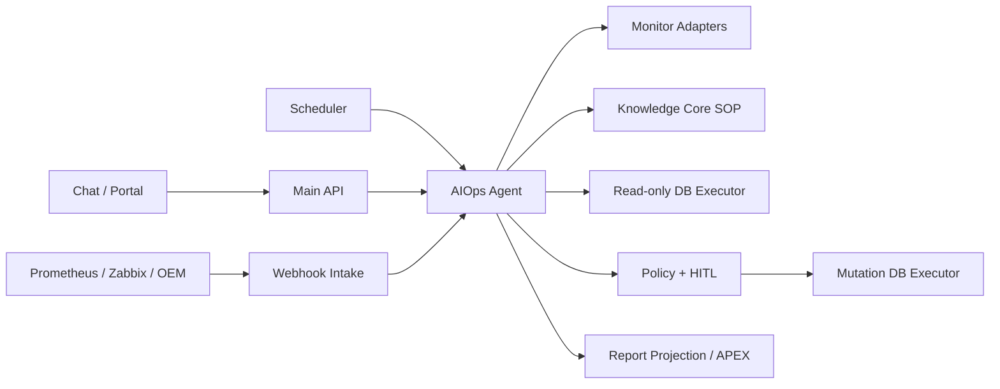
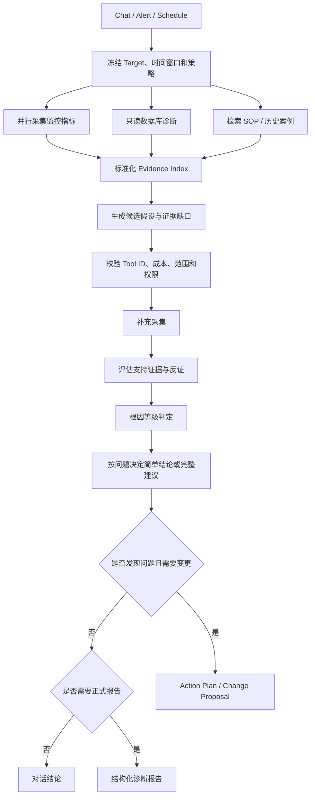
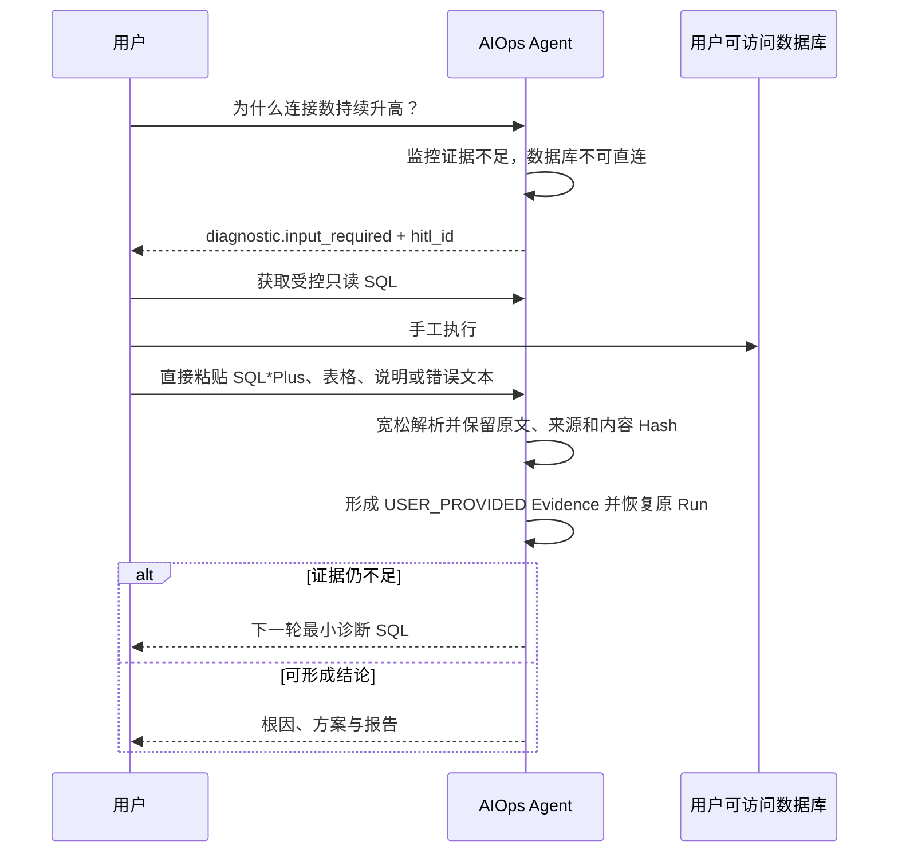

# KBot 4.0 AIOps Agent 产品能力与完整流程

## 一页产品概述

AIOps Agent 是独立部署、独立入口、拥有自己领域状态机的运维 Agent。它接入
Prometheus、Zabbix、OEM 和可选数据库连接，对 Oracle、MySQL、PostgreSQL 的性能
与故障进行
诊断，生成故障、性能、日巡检、周巡检和处理前后对比报告，并在受控策略下给出
或执行解决命令。

它不是通用聊天 Agent 的一个 Skill，也不会因为用户说“直接执行”就绕过策略。
未来新增其他数据库、监控源、IM 或 Email 时通过 Adapter/Port 扩展，不修改
诊断内核。

## 产品能力全景

| 能力域 | 4.0 能力 |
| --- | --- |
| 目标管理 | Oracle/MySQL/PostgreSQL Target、环境、版本、能力和托管凭据引用 |
| 监控接入 | Prometheus、Zabbix、OEM；同一 Target 可绑定多个来源 |
| 触发入口 | Chat、Critical Alert Webhook、定时巡检、内部 API |
| 诊断数据 | 指标、告警、只读数据库诊断、用户回贴结果、KC SOP |
| 根因分析 | 假设、支持证据、反证、数据缺口和根因等级 |
| 人机协作 | Chat 中请求用户执行只读 SQL 并回贴，可多轮恢复 |
| 解决方案 | 缓解建议、长期修复、验证和回滚方案 |
| 受控执行 | 动态能力判定；允许变更时仍须每条命令单独审批 |
| 报告 | Incident、Performance、Daily、Weekly、Comparison |
| 审计 | Run、Task、Artifact、Policy、审批、执行和验证全链路 |

IM/Email 当前只保留扩展端口，没有实现实际 Adapter。Shell、OEM Job 和
Zabbix Remote Command 只作为人工建议，不由系统执行。

三类数据库均提供版本化只读诊断目录。当前 PostgreSQL 只进入只读诊断链路；
Oracle/MySQL 还支持受控人工 SQL 和审批后变更。产品界面不能把 PostgreSQL Target
展示为具备相同的变更执行能力。

## 服务边界



AIOps Agent 拥有 `KBOT_OPS_*` 表和 Ops Run/Task/Artifact；DB Executor
持有目标连接并再次校验命令。Agent 不接收数据库密码，不直接创建目标数据库
Session，也不执行自由 SQL。

## 三种主要触发流程

### Chat

适合即时排障和多轮补证。用户可以追问、补充现象，也可以在数据库无法直连时
执行系统提供的只读 SQL 并回贴结果。

### Alert

AlertManager、Zabbix 或 OEM Webhook 经过验签、Target 映射、去重和幂等落库。
达到配置的 Critical 阈值后异步创建诊断 Run。自动流程不等待用户补数据；证据
不足时生成 `PARTIAL/INCONCLUSIVE` 报告。

### Schedule

日巡检、周巡检或 Cron 计划按时区展开为 Fire，再为每个有效 Target 创建独立
Run。重叠策略支持 `SKIP/QUEUE`。日报展示健康与异常，周报聚合趋势、反复告警、
未解决事项和上周对比。

## 根因诊断主流程



诊断 Blueprint 是版本化、不可变的 Task DAG。当前主链包含：

```text
scope
  → observe:* / diagnostic:*
  → diagnosis:evidence:r0
  → diagnosis:r1:draft
  → diagnosis:r1:validate
  → diagnosis:r1:collect
  → diagnosis:evidence:r1
  → diagnosis:r1:assess
  → diagnosis:root-cause
  → diagnosis:verify
  → diagnosis:solution
  → change:action-plan
  → change:proposal
  → diagnosis:report
```

LLM 负责假设、因果机制和证据综合；确定性代码负责 Target、时间窗口、权限、
Tool Allowlist、采集、脱敏、引用校验、根因等级上限和执行策略。

## Evidence 与根因可信度

每条事实都引用不可变 Artifact，并标记信任等级：

| 信任等级 | 示例 |
| --- | --- |
| `SOURCE_VERIFIED` | 监控 Adapter 或只读 DB Executor 的直接观测 |
| `USER_PROVIDED` | Chat 用户回贴的 SQL 结果 |
| `KNOWLEDGE_CITATION` | KC 返回的 SOP 或历史案例 |
| `MODEL_INFERENCE` | 模型假设、摘要和推断 |

SOP 可以解释机制，不能证明当前实例正在发生该问题。根因不使用一个不可解释的
浮点分数：

- `CONFIRMED`：直接证据、时间顺序和机制一致，关键替代假设已被反证；
- `PROBABLE`：多项一致证据，但仍缺少一项直接验证；
- `POSSIBLE`：只能解释部分症状或存在强替代假设；
- `INCONCLUSIVE`：数据质量不足、冲突或无法区分关键假设。

只有 `CONFIRMED/PROBABLE` 可以形成定向变更提案。

## 数据库不可连接时的 Chat 补证



优先使用对应数据库类型的版本化诊断模板。仅 Oracle/MySQL 在模板无法覆盖时允许
生成“仅供
人工执行”的单条 `SELECT/WITH`，并经过语法树和对象 Allowlist 校验；该 SQL
永远不会转交 Executor。此循环只对 Chat 生效。Alert/Schedule 不创建人工 SQL
请求，而是保存数据缺口并正常结束为部分报告。

## 动态能力、建议、审批和实际执行

AIOps Agent 不再配置 `OBSERVE / DIAGNOSE / PROPOSE / EXECUTE` 类型。每次
Run 根据当前绑定和可用资源计算有效能力：

- 有监控源即可采集指标；
- 有数据库 Endpoint 和只读凭据时，`SELECT/WITH` 可自动执行；
- Chat 中数据库不可直连或证据不足时，转为人工补证；
- “允许 Agent 执行变更”开关关闭、没有执行凭据或策略不允许时，只生成建议；
- 开关开启且执行资源完整时，也只能逐条审批后执行非只读命令。

建议深度同样由问题决定：事实查询优先直接回答；发现性能或故障问题时生成完整
缓解、修复、风险、回滚和验证建议。用户明确要求报告、自动告警/巡检触发，或
诊断发现问题时，才发布正式报告；普通问答只保存可追溯结论。

每条实际变更命令单独形成 Change Proposal：

```text
Diagnosis
  → Action Template + Parameters
  → Policy Gate
  → Proposal.PENDING_APPROVAL
  → 一位有权用户显式批准一次
  → 一次性 Approval Authorization
  → Executor Claim + Mutation Grant
  → Execute
  → Verify
  → Comparison Report
```

不支持整批命令一次批准。修改 Target、参数、模板版本或回滚方案后原审批失效。
多命令严格串行，上一条执行并验证后才进入下一条审批。浏览器不获得数据库凭据
或可重放的执行 Token。

## 处理前后对比

命令成功只代表 Executor 完成调用，不代表问题已解决。系统会：

1. 冻结处理前指标、窗口、来源和映射版本；
2. 等待配置的系统稳定时间；
3. 使用相同时长、单位和聚合方式采集处理后数据；
4. 比较主指标、告警状态和护栏指标；
5. 输出 `RESOLVED / IMPROVED / UNCHANGED / DEGRADED / INCONCLUSIVE`。

人工处理并确认完成后同样进入相同验证 Blueprint 和对比报告链路。没有可比基线时必须返回
`INCONCLUSIVE`，不能仅凭“命令执行成功”宣称恢复。

## 报告产品

| 报告 | 内容 |
| --- | --- |
| Incident | 故障时间线、影响、根因、证据、处置和当前状态 |
| Performance | 性能症状、瓶颈、关键指标和优化建议 |
| Inspection Daily | 当日健康、异常、风险和建议 |
| Inspection Weekly | 趋势、重复告警、未解决问题及环比 |
| Comparison | 处理前后指标、护栏、副作用和最终判级 |

报告正文是不可变 Artifact，`KBOT_OPS_REPORT` 保存便于 APEX 查询的当前版本
投影。更正报告创建新版本，不覆盖历史。

## AIOps SSE 与前端交互

`GET /api/v1/apps/aiops/runs/{run_id}/events` 支持 `Last-Event-ID` 续传。主要事件：

| 事件 | 前端表现 |
| --- | --- |
| `run.status` | Run 阶段和状态变化 |
| `task.status` | Scope、Observe、Diagnose、Report 等进度 |
| `artifact.created` | 新证据或诊断产物已保存 |
| `diagnostic.input_required` | 展示“需要补充数据库结果”卡片 |
| `diagnostic.input_received/skipped/expired` | 人工补证状态 |
| `proposal.pending_approval` | 展示待审批命令卡片 |
| `proposal.approved/rejected/expired` | 审批状态 |
| `execution.status` | 命令执行与验证状态 |
| `comparison.plan.created` | 已安排处理前后对比 |
| `report.ready` | 可打开结构化报告 |
| `run.completed/failed/cancelled/expired` | Run 终态 |
| `done` | SSE 结束 |

SSE 的人工输入事件只返回 `hitl_id` 和过期时间，不直接携带 SQL 正文；前端通过
授权详情接口读取。审批必须调用独立 API，聊天中的“同意”不是批准信号。

## 建议的 PPT 叙事

1. AIOps Agent 的产品目标和独立服务边界；
2. 监控、数据库、SOP、用户数据四类证据；
3. Chat、Alert、Schedule 三种入口；
4. 根因诊断 DAG；
5. “假设—证据—反证—等级”可信诊断；
6. 数据库不可连接时的多轮人工 SQL；
7. 数据源驱动的动态能力与“允许变更”开关；
8. 每条命令一次审批和 Executor 双重校验；
9. 处理前后对比为什么不可省略；
10. 五类报告及 APEX 展示；
11. SSE 实时交互和审计回放；
12. Demo：Critical 告警 → 根因 → 审批 → 执行 → 对比报告。
