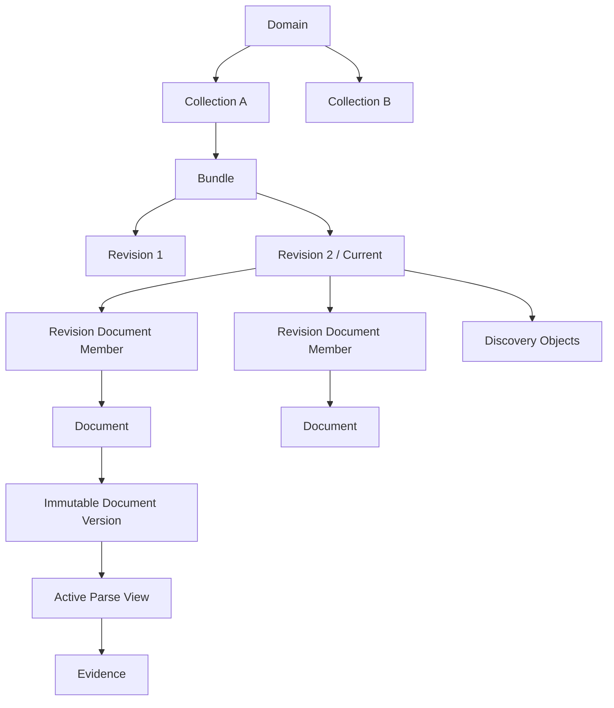
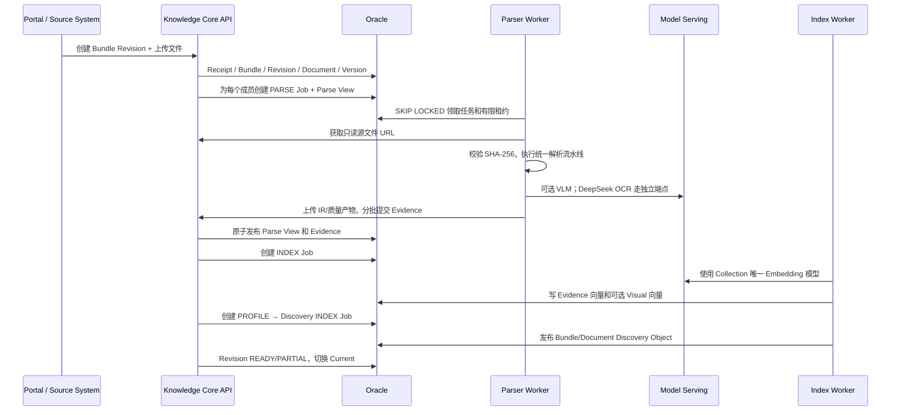

# KBot 4.0 文档入库、解析与二阶段检索

## 一页产品概述

Knowledge Core（KC）是 4.0 唯一拥有知识资产生命周期、解析结果和检索索引的
领域服务。它接收一个文件或一组相关文件，生成可发现的 Bundle/Document 画像
和可引用 Evidence；它不负责生成最终回答。

相较 3.x 的 `KB → Batch → File → Chunk`，4.0 的核心变化是：

- 用 Collection 表达权限和检索边界；
- 用 Bundle/Revision 表达一个业务知识对象及其不可变修订；
- 用 Document/Version 表达逻辑文件和物理内容版本；
- 用 Parse View 表达某次解析配置下的统一视图；
- 用 Evidence 替代缺少结构和出处的 Chunk；
- 分开“找对对象”和“找准正文”，形成二阶段检索。

## 知识对象层次



- 一个 Domain 有多个 Collection，强制隔离数据和权限；
- 一个 Bundle 可以只有一个文件，也可以由 PDF、Word、Excel 等多个文件组成；
- 多文件 Bundle 不要求存在 Primary Document；
- Revision 冻结本次标题、Facet、成员和状态；
- Document 是逻辑身份，Document Version 是内容 Hash 对应的不可变版本；
- 新 Revision 完成索引前不会替换 Current Revision。

## 两种上传方式

### 独立文件批量上传

用户一次上传 10 个互不相关的文件，系统创建 10 个 Bundle，每个 Bundle
包含一个 Document。

### 多文件组成一个 Bundle

用户上传 1 个 PDF、2 个 Word 和 1 个 Excel，并声明它们属于同一知识对象。
系统创建一个 Bundle Revision 和四个成员。Bundle Manifest/画像负责概括整体
标题、Facet、文件角色、章节覆盖和缺失成员，检索时不依赖虚构的 Primary 文件。

来源系统也可以随 Bundle 提交一个 `MANIFEST` 成员，例如业务对象的标题、编号、
Solution Briefing 和结构化字段。附件下载失败时保留失败成员，已成功文件仍可
解析；最终 Revision 可以是 `PARTIAL`。

## 从上传到可检索



所有 Job 都有幂等键、输入指纹、有限租约、心跳、重试次数和失败分类。
Worker 崩溃后可以重新领取；过期 Worker 不能用旧租约覆盖新结果。

## 自适应混合解析流水线

4.0 不再维护“Docling Chunk”和“纯视觉 Chunk”两套平行结果。Docling 是底层
文档转换引擎，文本、OCR 和视觉增强最终统一进入同一套结构与 Evidence 模型：

```text
源文件与 Hash 校验
  → Docling 转换、页面渲染和基础布局
  → 可选 DeepSeek OCR 精确文字增强
  → 可选页面级 VLM / Figure 描述
  → Atom IR 统一归一化
  → Reading Order 重建
  → Outline / 标题层级修复
  → Structure Quality Gate
  → Evidence Planner
  → Parse Artifacts + Evidence
```

### OCR 与视觉能力

| 能力 | 配置方式 | 未配置时 |
| --- | --- | --- |
| Docling 内置 OCR | 默认路径 | 正常进行文本解析 |
| DeepSeek OCR | KC Parser 独立 OpenAI 兼容端点 | 使用 Docling OCR |
| Parser VLM | Collection 绑定的可选模型 | 跳过页面视觉增强 |
| Visual Embedding | Collection 绑定的可选模型 | 不生成图像向量 |

启用 DeepSeek OCR 后关闭 Docling 内置 OCR，但继续使用 Docling 的布局转换和
页面渲染。DeepSeek OCR 不进入 Model Serving。VLM 与 Visual Embedding 相互
独立，缺少任意一项都不会阻断文本解析。

### `TEXT / AUTO / VISUAL / HYBRID`

- `TEXT`：仅使用文本、布局和 OCR；
- `AUTO`：按页面文字覆盖、平均置信度和乱码比例挑选低质量页进行 VLM 重建；
- `VISUAL`：对可渲染页面使用 VLM 重建，适合扫描件或已知视觉路径更优的 PDF；
- `HYBRID`：文本结构为主，使用视觉结果做页面级结构校正和图表语义补充。

健康页保留 Docling 的精确文本、表格和 bbox；低质量页允许 VLM Markdown
替换其低质量 Atom，同时优先保留精确 OCR 文字和数字。单页 VLM 失败时回退
Docling，不让局部增强破坏整份文档。

## 为什么需要 Atom IR、Structure IR 和 Evidence

`Atom IR` 保存标题、段落、列表、表格、单元格、图片描述等最小结构单元及其
页码、bbox、来源和置信度。`Structure IR` 重建阅读顺序、章节层级和父子关系。

Evidence Planner 再按语义边界生成检索单元：

- 标题不会脱离下属正文成为无意义短片段；
- 过短段落与相邻同章节内容合并；
- 超长章节按句子、列表项、表格边界拆分；
- 表格、行、Sheet 和 Cell Range 保留结构类型；
- 每条 Evidence 保存 `heading_path`、页码、bbox、Source Span、质量分和父子关系；
- `content_text` 用于引用，`retrieval_text` 可加入标题路径以提高召回。

质量门检查 Atom 覆盖、阅读顺序、标题层级、Evidence 长度、来源可追溯性和
定位完整性。未通过时任务失败，不发布“有文本但不可可信检索”的结果。

## 解析产物与可追溯性

Parser 保存以下不可变产物：

| 产物 | 用途 |
| --- | --- |
| `raw_docling` | 保留底层转换结果 |
| `atom_ir` | 统一原子结构 |
| `structure_ir` | 阅读顺序和章节树 |
| `evidence_manifest` | Evidence Key、内容和定位 Hash |
| `spreadsheet_artifact` | Excel Sheet、表格和结构信息 |
| `visual_analysis` | VLM 页面选择、替换和失败记录 |
| `deepseek_ocr_analysis` | OCR 模型、页级结果和失败记录 |
| `quality_report` | 质量指标、警告和硬失败 |

输出指纹同时覆盖 Artifact Hash 和 Evidence Key。KC 只有在租约、输入 Hash、
输出指纹和质量门全部通过后才激活 Parse View。

## 索引与模型一致性

每个 Collection 绑定唯一文本 Embedding 模型。解析不生成文本向量；INDEX
Worker 才使用 Collection 冻结的模型快照生成 Evidence 和 Discovery 向量。

写入前强制校验：

- `model_id`、`served_model_name` 和配置指纹一致；
- 模型维度等于全局配置维度；
- 返回向量数量和每条向量长度正确；
- 文档索引和查询召回使用同一个模型；
- 已产生索引的 Collection 不允许更换 Embedding 模型。

如果配置 Visual Embedding，INDEX 阶段还会为页面和 Figure 生成视觉向量。

## 二阶段检索

### 第一阶段：Discovery——先找对知识对象

```text
standalone_query
  → Collection/Domain/状态/安全级别过滤
  → Bundle/Document Discovery Object
  → Oracle Text + Vector
  → RRF 融合
  → Document 命中聚合到 Bundle
  → 多 Collection 平权交错
  → 候选 Bundle Revision
```

Discovery Object 是短小的检索画像，包含 Bundle 标题、来源标识、Facet、成员、
章节覆盖和缺失成员。它不返回大段正文。文本与向量结果按排名使用 RRF 融合，
避免比较不同通道不可直接对齐的原始分数。多个 Collection 平权检索，不设置
Primary Collection。

### 第二阶段：Evidence——在候选对象内找准内容

```text
候选 Bundle Revision / Document Scope
  → 只在候选范围搜索 ACTIVE Evidence
  → Oracle Text + Vector 锚点召回
  → Evidence ID、Parse View 去重
  → 同 Document Version / Section 邻近扩展
  → PRIMARY 与 STRUCTURAL_CONTEXT 分组
  → Citation Pack
```

第二阶段不能回到全库重新选 Chunk。直接命中的 Evidence 是 `PRIMARY`，相邻标题、
上下文段落等只作为 `STRUCTURAL_CONTEXT`，不能抢占引用。Citation Pack 为本次
请求分配 `C1/C2...`，并保留 Bundle、Document、Version、Evidence、章节、页码
和 bbox。

KC 不设置独立重排阶段。混合检索与 RRF 负责产生候选 Bundle，Evidence 阶段为
每个候选保留可引用的正文证据；同一 Bundle 的 Evidence Group 在进入 Composer 前
合并为一个引用候选。Composer 在生成答案时忽略不相关 Bundle，并返回正文实际使用
的引用标签。后端严格保证正文标签、`used_citation_labels` 与附件列表完全一致，且
同一个 Bundle 只生成一个附件。

### 图片查询

聊天可上传多张图片：

- 配置 Visual Embedding：每张图分别召回相似页面/Figure，再用 RRF 融合；
- 配置查询 VLM：把图片转成检索描述，参与文本 Discovery；
- 两者都配置：视觉候选与文本候选合并；
- 都未配置：跳过图片并通过 SSE/最终警告告知前端。

视觉相似度只负责发现候选，最终回答仍必须引用正文 Evidence。

## 失败、重解析和版本切换

- 单文件解析失败：成员记录失败原因，Revision 按整体结果进入 `FAILED/PARTIAL`；
- 临时网络或模型错误：Job 进入 `RETRY_WAIT`，退避后重试；
- 解析参数变化：创建新的不可变 Parse View；
- 新 Parse View 成功后再删除旧解析结果，避免重解析窗口不可检索；
- 失败的新 Parse View 不影响旧 Active View；
- 新 Revision 完成解析、Profile 和 Index 后才切换 Current；
- Collection 被 Agent 绑定时不可删除；未被使用时可级联删除全部内容。

## 建议的 PPT 叙事

1. 3.x Chunk 模型为何限制召回质量；
2. Domain → Collection → Bundle → Document → Evidence；
3. 单文件与多文件 Bundle 两种产品场景；
4. 上传到可检索的完整时序；
5. Docling + DeepSeek OCR + VLM 的统一解析路线；
6. 标题、短片段、表格和阅读顺序如何修复；
7. Parse View、质量门和不可变产物；
8. Collection 唯一 Embedding 模型；
9. Discovery 找对象、Evidence 找正文；
10. 图片搜图片与图片转文字；
11. 真实 Citation 如何回到页码和坐标；
12. Demo：上传复杂 PDF → 查看质量 → 问答并打开原文位置。
