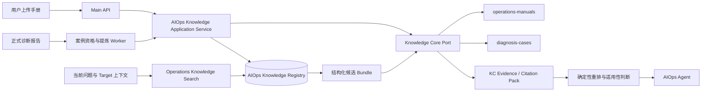

# AIOps 运维知识库详细设计

## 1. 目标与设计结论

AIOps 运维知识库用于在当前诊断、巡检、实施方案和故障复盘中定位可复用的运维知识，
统一管理两类来源：

1. 用户上传的正式运维手册；
2. 已完成诊断产生、经过提炼和审核的历史诊断案例。

本设计不新建第二套文档解析、OCR、切片、Embedding、全文检索或向量检索引擎。
Knowledge Core（KC）继续承担内部索引基础设施，AIOps 新增运维知识资产、案例治理、
结构化候选筛选、发布审核和 Agent 使用规则。产品页面和业务 API 不再向普通用户暴露
Collection、Bundle、Embedding 等 KC 技术概念。

设计结论如下：

- 产品名称统一为“运维知识库”，不再把页面命名为 “Knowledge Core”；
- AIOps 是运维知识资产的业务所有者，KC 只是解析、索引和证据检索依赖；
- 原始手册始终是手册知识的权威来源，提炼结果只用于定位、过滤和解释；
- 原始诊断报告继续属于 Report/Artifact 体系，只有符合条件的报告才生成诊断案例；
- 历史案例只能提供相似处理经验，不能替代当前 Target 的实时证据和执行前校验；
- Agent 使用新的 `ops.knowledge.search` 受控工具，不复用只搜索本轮附件的
  `artifact.search`；
- 逻辑上只有一个运维知识库，物理上使用手册与诊断案例两个固定 KC Collection；
- 新增业务表只使用主键、外键和列级 `NOT NULL`。状态、枚举、版本号、去重和字段组合
  关系全部由应用合同、领域服务和事务处理负责，不增加 `CHECK`、`UNIQUE` 或唯一索引。

本文是目标态详细设计，不表示相关表、API、页面或检索链路已经实施。

## 2. 当前实现与问题

当前 AIOps 初始化一个固定 `operations-manuals` Collection，Main API 直接把用户上传文件
流式送入 KC，并由页面立即批准对应 Revision。现有页面同时承担 Collection 状态、模型选择
和文件上传，用户需要理解 KC 内部概念。

现状存在以下缺口：

- AIOps 没有独立的运维知识资产、版本、适用范围、审核和发布状态；
- 上传文件完成 KC 入库不等于已经形成可用于数据库运维的可靠知识；
- `artifact.search` 只查询本轮上传的文本附件，不能搜索正式运维手册或历史诊断；
- `KBOT_OPS_REPORT` 和 `KBOT_OPS_REPORT_SOURCE` 能追溯正式报告及原始证据，但没有
  “可复用案例”投影；
- KC Evidence 检索需要先给出候选 Bundle，当前 AIOps 没有基于数据库类型、版本、问题类型、
  错误码和拓扑的候选发现层；
- 完整历史报告可能包含失败调查、未验证建议、环境特有事实和已经过时的结论，不能直接作为
  解决方案知识发布；
- 手册全文直接切片可以回答字面问题，但难以稳定识别前置条件、停止条件、验证和回退步骤。

因此，本次重构解决的是 AIOps 业务层缺失，而不是替换 KC 的底层技术能力。

## 3. 范围与非目标

### 3.1 本设计范围

- 用户上传手册、版本更新、结构化提炼、审核、发布和退役；
- 正式诊断报告的案例资格判断、自动提炼、审核、发布和退役；
- 运维知识候选发现、KC 证据检索、确定性重排和引用；
- Agent 在诊断、解释、规划和实施方案生成中的知识使用边界；
- 运维知识库页面、权限、审计、状态、错误处理和可观测性；
- AIOps 业务表、应用服务、内部端口和迁移边界。

### 3.2 非目标

- 不允许用户把运维知识库当作自由 SQL 或脚本执行器；
- 不从历史案例自动创建 Change Proposal 或绕过当前环境校验；
- 不把所有历史报告批量无审核发布为知识；
- 不复制完整日志仓库、AWR 原文或数据库查询结果到 KC；
- 不在 AIOps 中重写 KC 的解析、OCR、切片、Embedding 和 Citation Pack；
- 不让模型决定 Domain、Target 权限、安全等级或知识发布状态；
- 不通过兼容路由、双写或双读长期保留旧 `knowledge-core` 产品接口。

## 4. 术语与业务对象

| 对象 | 含义 |
| --- | --- |
| `OperationsKnowledgeAsset` | 一项稳定的运维知识资产身份 |
| `OperationsKnowledgeVersion` | 资产的一次不可变内容和提炼版本 |
| `ManualProfile` | 从原始手册中提取的结构化适用范围、章节和操作流程 |
| `ProcedureCard` | 对应手册中一个独立操作主题的导航卡片 |
| `DiagnosisCase` | 从正式诊断报告提炼、审核并可复用的历史案例 |
| `KnowledgeScope` | 数据库类型、版本、拓扑、组件、问题类型和错误码等过滤维度 |
| `KnowledgeSource` | 原始手册、Report、Run、Artifact 和证据引用关系 |
| `KnowledgeIndexRef` | AIOps 版本到 KC Collection、Bundle、Revision 的索引引用 |
| `KnowledgeReview` | 发布、拒绝、退役和重新审核的审计记录 |

资产类型首版固定为：

- `MANUAL`：用户上传或系统内置的正式运维手册；
- `DIAGNOSIS_CASE`：从正式诊断结果提炼的案例。

未来如增加厂商公告、补丁说明或内部标准，必须先明确其权威性和生命周期，不能只增加一个
字符串类型后直接进入 Agent 检索。

## 5. 总体架构



### 5.1 服务职责

| 服务 | 职责 |
| --- | --- |
| Main API | 用户认证、权限校验、流式转发和稳定错误映射，不编排知识生命周期 |
| AIOps Agent | 资产登记、版本、提炼、审核、发布、候选筛选、检索策略和审计 |
| Knowledge Core | 文件解析、OCR、切片、全文/向量索引、上下文扩展和 Citation Pack |
| Model Serving | 手册/案例结构化提炼及查询向量所需的受控模型调用 |
| Report/Artifact | 保存正式报告及其冻结证据来源，不被知识库替代 |

Main API 不再直接把“上传成功”等价为“知识发布成功”。上传请求由 AIOps 应用服务建立
资产版本并驱动 KC 入库；KC 内部批准只代表允许解析和索引，不代表 AIOps 业务发布。
AIOps Candidate Resolver 只返回 `PUBLISHED` 版本，因此未审核内容即使已经完成 KC 索引，
也不能被 Agent 检索到。

### 5.2 KC Collection 规划

逻辑上向用户呈现一个运维知识库，物理上使用两个固定 Collection：

| Collection | 内容 | 原因 |
| --- | --- | --- |
| `operations-manuals` | 原始手册、提炼 Profile 和 Procedure Card | 保持正式手册的独立版本、权威性和重建周期 |
| `diagnosis-cases` | 审核后的诊断案例正文和证据摘要 | 独立控制保留期、召回权重、审核和退役 |

两个 Collection 都属于 `aiops_portal` Domain，并带有 `owner_app_id=aiops` 和固定资源标记。
Collection ID、模型和内部处理状态只在管理员诊断界面显示，不进入普通用户的主流程。

手册 Bundle 使用原始文件作为 `CONTENT`，提炼后的 Profile 和 Procedure Card 作为
`SUPPLEMENT`。生成补充文档时创建新的 Bundle Revision，只有该 Revision 成为 Bundle 当前版本
后才允许业务发布。诊断案例 Bundle 只保存脱敏后的案例正文和必要的证据摘要，不复制完整报告、
原始日志或大体积诊断附件；来源报告仍通过 AIOps `KnowledgeSource` 关联。

## 6. 用户上传手册处理

### 6.1 上传输入

上传表单允许用户提供原始文件，并填写以下可选元数据：

- 显示名称；
- 文档来源和维护组织；
- 文档版本和发布日期；
- 数据库类型和版本范围；
- 操作系统、云平台和部署拓扑；
- 主题分类；
- 安全等级和适用范围；
- 备注。

用户填写值优先于自动提炼值，但不能静默覆盖明显冲突。系统检测到“用户选择 Oracle 19c，
正文只描述 PostgreSQL”等冲突时，将版本置为 `REVIEW_REQUIRED`，展示双方值和原文证据，
由拥有 `aiops:knowledge_manage` 的用户确认。

### 6.2 手册提炼原则

手册不按诊断案例方式重写。处理结果由三层组成：

1. **原始文件**：权威内容和最终引用来源；
2. **Manual Profile**：面向候选过滤和页面展示的结构化元数据；
3. **Procedure Card**：按独立操作主题生成的导航卡片，用于定位相关章节。

提炼不得：

- 创建原文不存在的命令、参数、前置条件或结论；
- 把模型推断标记为手册原文；
- 用摘要替换原始手册；
- 合并不同版本手册中的步骤后生成一个不存在的流程；
- 删除原文中的限制条件、警告、回退和验证要求。

### 6.3 Manual Profile 合同

`OPS_MANUAL_PROFILE.v1` 至少包含：

```json
{
  "schema_version": "OPS_MANUAL_PROFILE.v1",
  "title": "Oracle Data Guard 运维手册",
  "source": {
    "asset_id": "uuid",
    "asset_version_id": "uuid",
    "document_version": "1.2",
    "publisher": "DBA Team"
  },
  "scope": {
    "database_types": ["ORACLE"],
    "database_versions": ["19c", "23ai", "26ai"],
    "topologies": ["CDB", "RAC", "SINGLE_INSTANCE"],
    "platforms": ["LINUX"]
  },
  "topics": ["DATA_GUARD", "SWITCHOVER", "FAILOVER"],
  "procedures": [],
  "warnings": [],
  "missing_fields": [],
  "source_evidence_ids": []
}
```

所有结构化字段必须保留来源 Evidence ID 或原文定位符。没有来源支持的字段进入
`missing_fields`，不能由模型猜测补齐。

### 6.4 Procedure Card 合同

一份长手册可以产生多张 `OPS_PROCEDURE_CARD.v1`，每张卡片对应一个可以独立检索的操作主题：

```json
{
  "schema_version": "OPS_PROCEDURE_CARD.v1",
  "procedure_key": "configure-archive-mode",
  "title": "开启 Oracle 归档模式",
  "intent": "CHANGE",
  "scope": {},
  "preconditions": [],
  "stop_conditions": [],
  "steps": [
    {
      "ordinal": 1,
      "description": "在 CDB Root 检查当前日志模式",
      "command_text": "SELECT LOG_MODE FROM V$DATABASE;",
      "source_evidence_ids": []
    }
  ],
  "validations": [],
  "rollback": [],
  "risks": [],
  "source_locator": {}
}
```

Procedure Card 中的命令只能逐字来自原文或由确定性格式清理产生。Agent 最终展示命令时引用
原始手册 Evidence；卡片只负责发现和组织，不成为比原文更高等级的事实来源。

### 6.5 手册版本流程

```text
UPLOADING → PROCESSING → DRAFT ───────────────→ PUBLISHED → RETIRED
                    │       └→ REVIEW_REQUIRED ─→ PUBLISHED
                    └──────────────────────────→ FAILED
```

- `PROCESSING`：KC 正在解析、OCR、切片或建立索引；
- `DRAFT`：原文和提炼结果已经形成，但尚未发布；
- `REVIEW_REQUIRED`：存在元数据冲突、高风险命令、来源缺失或提炼告警；
- `PUBLISHED`：可以进入 Agent 候选发现；
- `RETIRED`：不再参与新检索，但历史 Run 中的引用仍可解析；
- `FAILED`：本版本处理失败，可重试，不影响上一已发布版本。

状态迁移由应用服务校验。数据库列只保存状态值，不建立业务 `CHECK`。
即使没有提炼告警，发布也必须由拥有管理权限的用户显式触发；系统不得恢复当前页面的
“上传并自动批准为可检索知识”行为。

新文件替换现有手册时创建新版本。新版本发布成功后，应用事务把它设置为当前发布版本，
再将旧版本退出候选集合；不得先停用旧版本后等待新版本索引，避免检索空窗。

## 7. 诊断报告案例提炼

### 7.1 报告与案例的边界

正式报告用于还原一次实际诊断，诊断案例用于复用已经验证的经验。案例不复制整份报告，
只保存问题特征、根因、处理、验证、适用性和来源引用。

以下内容不进入案例正文：

- 与问题无关的完整指标、日志和 SQL 列表；
- 密码、令牌、完整连接串和托管凭据；
- 没有影响根因或处置判断的环境标识；
- 模型中间思考、未采用假设和内部 Prompt；
- 没有证据支持的建议；
- 原始 AWR、pgBadger 或其他大体积附件正文。

### 7.2 案例资格

报告结束后只创建“案例提炼候选”，不自动发布。至少满足以下条件才允许进入审核：

- 报告已经冻结且来源 Run 处于终态；
- Target、数据库类型、数据库版本和时间范围可以确定；
- 至少存在一个有证据引用的 Finding 或 Root Cause；
- 来源 Artifact 内容哈希可以复核；
- 报告没有安全扫描阻断项；
- 案例正文能明确区分事实、推断、建议和实际执行结果。

案例可分为两种复用等级：

| 等级 | 条件 | Agent 用法 |
| --- | --- | --- |
| `DIAGNOSTIC_REFERENCE` | 根因或排查路径有充分证据，但没有已验证处置 | 仅借鉴排查方向，不声称方案有效 |
| `VERIFIED_RESOLUTION` | 处置已执行，并形成 `RESOLVED` 或 `IMPROVED` 验证 | 可借鉴处理步骤，但仍需当前环境校验 |

报告为 `FAILED`、只有“证据不足”、根因已经被后续报告推翻，或者执行结果为 `DEGRADED` 时，
不得发布为案例。`PARTIAL` 报告只有在其中存在独立、可验证且边界明确的 Finding 时，才允许
提炼为 `DIAGNOSTIC_REFERENCE`。

### 7.3 Diagnosis Case 合同

`OPS_DIAGNOSIS_CASE.v1` 至少包含：

```json
{
  "schema_version": "OPS_DIAGNOSIS_CASE.v1",
  "case_kind": "VERIFIED_RESOLUTION",
  "problem_signature": {
    "problem_class": "DATABASE_PERFORMANCE",
    "component": "TABLESPACE_IO",
    "error_codes": [],
    "normalized_symptoms": [],
    "signal_names": []
  },
  "environment": {
    "database_type": "ORACLE",
    "database_version": "19c",
    "topology": "CDB_RAC",
    "platform": "LINUX"
  },
  "root_cause": {
    "summary": "",
    "confidence": "HIGH",
    "evidence_refs": []
  },
  "actions": [],
  "verification": {
    "result": "IMPROVED",
    "before_refs": [],
    "after_refs": [],
    "guardrail_refs": []
  },
  "applicability": [],
  "contraindications": [],
  "source": {
    "report_id": "uuid",
    "run_ids": [],
    "content_hash": "sha256"
  }
}
```

案例中的每个根因、动作和验证结论必须能追溯到冻结 Report 或 ReportSource。案例提炼器不能
读取会话中未进入正式报告的临时回答并将其提升为知识。

### 7.4 案例状态流

```text
ELIGIBILITY_PENDING → EXTRACTING → DRAFT → REVIEW_REQUIRED → PUBLISHED → RETIRED
                                  └──────→ REJECTED
                 └──────────────────────→ FAILED
```

案例默认需要人工发布。审核者可以修正分类、适用范围和脱敏结果；修改根因、命令或验证结论时
必须创建新版本，并保留原始提炼、修改人和修改原因，不能直接覆盖审计记录。

若来源报告被更正，新报告发布后将关联案例置为 `REVIEW_REQUIRED`。旧案例在重新审核前停止进入
新的候选集合，但历史 Run 的引用保持可读。

## 8. 统一发布与可信度

### 8.1 来源权威顺序

Agent 重排时使用以下权威顺序，相关性不足时不能仅凭等级强行返回：

1. 与当前版本、拓扑相符的官方或组织批准手册；
2. 与当前环境相符的 `VERIFIED_RESOLUTION` 案例；
3. 已审核的 `DIAGNOSTIC_REFERENCE` 案例；
4. 只用于候选发现的提炼卡片。

`DRAFT`、`REVIEW_REQUIRED`、`FAILED`、`REJECTED` 和 `RETIRED` 不参与新的 Agent 检索。

### 8.2 适用范围

每个发布版本至少记录以下可选维度：

- 数据库类型；
- 数据库产品版本和主版本范围；
- CDB/PDB、单实例、RAC、复制或云数据库等拓扑；
- 操作系统和云平台；
- 数据库组件；
- 问题类别；
- 错误码、告警规则或信号名称；
- Target 限定或 Domain 通用范围；
- 安全等级。

未知维度保持未知，不用 `ANY` 掩盖缺失事实。候选筛选可以允许未知项进入低权重候选，但回答
必须提示适用性尚未确认。

### 8.3 知识不会提升现场证据等级

手册和历史案例属于 `KNOWLEDGE_CITATION`，不是当前 Target 的 `SOURCE_VERIFIED` Evidence。
它们可以说明应该检查什么、类似问题如何处理，但不能证明当前数据库已经满足前置条件、存在
相同根因或已经恢复。

涉及变更时仍必须：

1. 使用当前 Target 的只读工具核实对象、版本、参数和状态；
2. 使用受控 Action Catalog 或实施文档合同生成命令；
3. 按现有策略进行审批；
4. 执行后重新采集当前环境证据并验证。

## 9. 检索设计

### 9.1 两阶段检索

运维知识检索固定为两阶段，禁止在全部 KC 文档上直接执行无边界向量搜索：

```text
当前问题 + Target Snapshot
    ↓
AIOps 结构化候选发现
    ↓
限定 Collection / Bundle / Revision
    ↓
KC 全文 + 向量 Evidence 检索
    ↓
AIOps 适用性、权威性和验证等级重排
    ↓
带引用的手册章节与历史案例
```

第一阶段由 AIOps Repository 查询 `PUBLISHED` 当前版本，并按 Domain、安全等级、Target 授权、
数据库类型、版本、拓扑、问题分类、组件和错误码筛选。第二阶段使用 KC 现有 Evidence API，
只在候选 Bundle 内检索正文。

### 9.2 问题指纹

问题指纹由确定性字段和规范化语义组成：

```json
{
  "database_type": "ORACLE",
  "database_major_version": "19",
  "topology": "CDB_RAC",
  "problem_class": "DATABASE_AVAILABILITY",
  "components": ["ARCHIVE_DESTINATION"],
  "error_codes": ["ORA-16014"],
  "signal_names": ["database.archive_destination_problem"],
  "symptom_terms": ["archive destination full"]
}
```

数据库类型、版本和 Target 上下文来自当前 Agent/Target Snapshot，模型不得覆盖。问题分类、组件
和症状词可由 Planner 提议，但必须通过允许值合同归一化。

### 9.3 候选排序

候选排序由确定性代码计算，至少考虑：

- 数据库类型是否完全匹配；
- 主版本和拓扑是否匹配；
- 错误码、信号名称和组件是否匹配；
- 问题分类是否匹配；
- 手册权威等级；
- 案例验证等级；
- 知识版本是否仍有效；
- KC 正文相关性；
- 来源是否限定到用户无权访问的 Target。

具体权重属于版本化检索策略，不写入 Prompt。检索结果必须返回命中原因和不匹配维度，便于
Agent 说明“相似在哪里、差异在哪里”。

### 9.4 降级行为

- AIOps Registry 可用、KC 不可用：返回稳定的知识检索不可用错误，不把 Profile 摘要伪装为
  正文证据；诊断可以继续使用现场工具。
- KC 全文通道失败、向量通道可用：保留向量结果并记录降级告警；反之亦然。
- 没有结构化候选：返回 `NO_APPLICABLE_KNOWLEDGE`，不扩大到跨 Domain 全库搜索。
- 有候选但没有正文命中：返回候选覆盖和数据缺口，不生成无引用建议。
- 索引引用失效：排除该版本，记录 `STALE_INDEX_REFERENCE` 并提交修复任务。

## 10. Agent 工具与使用合同

### 10.1 新工具

新增受控工具 `ops.knowledge.search@1.0.0`。它与 `artifact.search` 的职责不同：

| 工具 | 范围 |
| --- | --- |
| `artifact.search` | 当前 Turn 中用户上传的文本附件 |
| `ops.knowledge.search` | 已发布的正式手册和历史诊断案例 |

建议输入合同：

```json
{
  "query": "需要定位的运维问题或操作主题",
  "purpose": "DIAGNOSE",
  "problem_class": "DATABASE_AVAILABILITY",
  "components": ["ARCHIVE_DESTINATION"],
  "error_codes": ["ORA-16014"],
  "source_kinds": ["MANUAL", "DIAGNOSIS_CASE"],
  "max_results": 8
}
```

Target ID、Domain、数据库类型、数据库版本、拓扑、安全等级和允许 Collection 由服务端注入，
不接受模型提交。

建议输出合同：

```json
{
  "status": "READY",
  "results": [
    {
      "asset_kind": "MANUAL",
      "title": "Oracle Data Guard 运维手册",
      "version": "1.2",
      "authority": "APPROVED_MANUAL",
      "applicability": "MATCHED",
      "matched_dimensions": ["database_type", "database_version"],
      "mismatched_dimensions": [],
      "citation_pack": []
    }
  ],
  "warnings": []
}
```

### 10.2 Planner 使用规则

以下意图可以按需使用知识检索：

- `DIAGNOSE`：寻找已知问题、排查路径和相似案例；
- `EXPLAIN`：引用正式手册解释机制或参数；
- `PLAN`：生成实施文档时定位官方步骤、验证和回退；
- `CHANGE`：只作为方案来源，不能替代当前状态校验；
- `VERIFY`：查找规范验证方法，实际结论仍来自当前证据。

简单状态查询、已经有充分现场证据的数值回答，不应为了展示知识库而强制调用该工具。

### 10.3 回答规则

Agent 回答必须区分：

- “手册规定”：引用原始手册章节；
- “历史案例表明”：引用案例并显示数据库版本、拓扑和验证结果；
- “当前环境确认”：引用当前 Run Evidence；
- “尚未确认”：列出仍需检查的当前环境事实。

当手册和案例冲突时，以适用版本的已批准手册为准，并说明案例可能过期。不同手册互相冲突时，
不得自行选择一个执行，应展示来源、版本和冲突点。

## 11. 持久化设计

### 11.1 表结构

以下为目标态逻辑表，最终 DDL 在实施时进入 `database/oracle/aiops_agent/` 规范 Schema。

#### `KBOT_OPS_KNOWLEDGE_ASSET`

保存稳定资产身份：

- `ASSET_ID`：主键；
- `DOMAIN_ID`：业务 Domain；
- `ASSET_KIND`：`MANUAL` 或 `DIAGNOSIS_CASE`；
- `DISPLAY_NAME`；
- `STATUS`：资产总体状态；
- `CURRENT_VERSION_ID`：当前发布版本，可空；
- `SECURITY_LEVEL`；
- `CREATED_BY`、`UPDATED_BY`；
- `CREATED_AT`、`UPDATED_AT`；
- `ROW_VERSION`：应用乐观锁。

#### `KBOT_OPS_KNOWLEDGE_VERSION`

保存不可变版本及提炼结果：

- `ASSET_VERSION_ID`：主键；
- `ASSET_ID`：外键；
- `VERSION_NO`；
- `STATUS`；
- `SOURCE_HASH`；
- `PROFILE_SCHEMA_VERSION`；
- `PROFILE_JSON`；
- `EXTRACTION_WARNINGS_JSON`；
- `PUBLISHED_AT`、`RETIRED_AT`；
- `CREATED_BY`、`CREATED_AT`；
- `ROW_VERSION`。

版本号递增、同一资产只能有一个当前发布版本、状态迁移和 JSON Schema 校验均由应用层负责。

#### `KBOT_OPS_KNOWLEDGE_SCOPE`

保存可索引的结构化范围：

- `SCOPE_ID`：主键；
- `ASSET_VERSION_ID`：外键；
- `SCOPE_KIND`：数据库类型、版本、拓扑、组件、问题分类、错误码等；
- `SCOPE_VALUE`；
- `NORMALIZED_VALUE`；
- `SOURCE_KIND`：用户输入、原文提炼或报告事实；
- `SOURCE_LOCATOR_JSON`；
- `CREATED_AT`。

重复范围值由应用层归并，不建立唯一约束。

#### `KBOT_OPS_KNOWLEDGE_SOURCE`

保存来源关系：

- `SOURCE_ID`：主键；
- `ASSET_VERSION_ID`：外键；
- `SOURCE_KIND`；
- `SOURCE_REPORT_ID`：可空，外键到 `KBOT_OPS_REPORT`；
- `SOURCE_RUN_ID`：可空，外键到 `KBOT_OPS_RUN`；
- `SOURCE_ARTIFACT_ID`：可空，外键到 `KBOT_OPS_ARTIFACT`；
- `SOURCE_EXTERNAL_ID`：手册文件或 KC 文档等跨服务引用；
- `CONTENT_HASH`；
- `SOURCE_LOCATOR_JSON`；
- `CREATED_AT`。

不同来源类型需要哪些字段由应用合同验证，不使用字段组合 `CHECK`。

#### `KBOT_OPS_KNOWLEDGE_INDEX`

保存 KC 索引引用：

- `INDEX_REF_ID`：主键；
- `ASSET_VERSION_ID`：外键；
- `COLLECTION_ID`；
- `BUNDLE_ID`；
- `BUNDLE_REVISION_ID`；
- `INDEX_STATUS`；
- `EXPECTED_ROW_VERSION`；
- `LAST_CHECKED_AT`；
- `ERROR_CODE`、`ERROR_SUMMARY`；
- `CREATED_AT`、`UPDATED_AT`。

KC ID 是跨服务引用，不创建数据库外键。发布前必须确认 Bundle 当前 Revision、Availability
和预期行版本一致，不能只以 Revision `READY` 判断可用。

#### `KBOT_OPS_KNOWLEDGE_REVIEW`

保存不可变审核事件：

- `REVIEW_ID`：主键；
- `ASSET_VERSION_ID`：外键；
- `DECISION`；
- `REVIEWER_ID`；
- `COMMENT_TEXT`；
- `BEFORE_STATUS`、`AFTER_STATUS`；
- `CREATED_AT`。

### 11.2 索引

只建立普通非唯一索引，至少覆盖：

- Domain、资产类型、状态、更新时间；
- Asset ID、版本号；
- Scope Kind、Normalized Value、版本 ID；
- Source Report ID、Run ID、Artifact ID；
- Index Status、更新时间；
- 待审核状态和创建时间。

幂等键和业务唯一性由应用 Repository 在事务中锁定并判断，不使用唯一索引绕过数据库约束原则。

### 11.3 事务边界

- Repository 不调用 `commit()`；
- AIOps Unit of Work 负责资产、版本、范围、来源、审核和 Outbox 的同事务提交；
- KC 是外部服务，使用持久化任务和幂等键协调，不能与 Oracle 事务伪装成分布式事务；
- KC 成功、AIOps 提交失败时由对账 Worker 识别孤立 Revision；
- AIOps 提交成功、KC 失败时版本保持非发布状态并允许重试；
- 发布操作先确认 KC 引用可用，再在一个 AIOps 事务内切换当前版本和写审核事件。

## 12. 应用服务与端口

### 12.1 AIOps 应用服务

- `OperationsKnowledgeCommandService`：上传、创建版本、发布、拒绝和退役；
- `ManualExtractionService`：生成 Profile 和 Procedure Card；
- `DiagnosisCaseExtractionService`：资格判断和案例提炼；
- `OperationsKnowledgeSearchService`：候选发现、KC 检索和重排；
- `KnowledgeIndexReconciliationService`：索引状态对账和修复；
- `KnowledgeReviewService`：审核事件和版本切换。

API Adapter 只解析请求、校验权限并调用应用服务。SQLAlchemy 访问只存在于 Repository，
跨服务调用通过 Port/Client 完成。

### 12.2 内部端口

```text
KnowledgeCoreIngestionPort
KnowledgeCoreStatusPort
KnowledgeCoreEvidencePort
KnowledgeExtractionModelPort
KnowledgeArtifactSanitizerPort
KnowledgeSearchPolicyPort
```

KC Client 返回稳定的内部错误码，AIOps 不根据异常字符串判断状态。

## 13. API 设计

以下路由属于目标态建议，实施后以 OpenAPI 快照为准。

### 13.1 公开 Main API

```text
GET    /api/v1/apps/aiops/operations-knowledge/overview
GET    /api/v1/apps/aiops/operations-knowledge/assets
GET    /api/v1/apps/aiops/operations-knowledge/assets/{asset_id}
GET    /api/v1/apps/aiops/operations-knowledge/assets/{asset_id}/versions
GET    /api/v1/apps/aiops/operations-knowledge/versions/{version_id}
GET    /api/v1/apps/aiops/operations-knowledge/versions/{version_id}/source
POST   /api/v1/apps/aiops/operations-knowledge/manuals
POST   /api/v1/apps/aiops/operations-knowledge/assets/{asset_id}/versions
POST   /api/v1/apps/aiops/operations-knowledge/versions/{version_id}:publish
POST   /api/v1/apps/aiops/operations-knowledge/versions/{version_id}:reject
POST   /api/v1/apps/aiops/operations-knowledge/versions/{version_id}:retire
POST   /api/v1/apps/aiops/operations-knowledge/versions/{version_id}:retry
GET    /api/v1/apps/aiops/operations-knowledge/reviews
POST   /api/v1/apps/aiops/operations-knowledge/search-preview
```

上传使用 multipart 流式转发、`Idempotency-Key` 和文件摘要，不把文件写入 Main API 本地目录。
发布、拒绝、退役和重试使用 `expected_row_version`，冲突返回稳定的并发错误。

### 13.2 AIOps 内部 API

```text
POST /internal/v1/aiops/operations-knowledge/manuals:ingest
POST /internal/v1/aiops/operations-knowledge/reports/{report_id}:extract-case
POST /internal/v1/aiops/operations-knowledge:search
POST /internal/v1/aiops/operations-knowledge/index-reconciliation:run
```

内部调用要求 audience-bound AuthContext JWT 和 AIOps 专用 Scope，不能转发 Portal API Key。

### 13.3 稳定错误码

至少包括：

- `AIOPS_KNOWLEDGE_ASSET_NOT_FOUND`；
- `AIOPS_KNOWLEDGE_VERSION_CONFLICT`；
- `AIOPS_KNOWLEDGE_SOURCE_REJECTED`；
- `AIOPS_KNOWLEDGE_EXTRACTION_FAILED`；
- `AIOPS_KNOWLEDGE_REVIEW_REQUIRED`；
- `AIOPS_KNOWLEDGE_INDEX_PENDING`；
- `AIOPS_KNOWLEDGE_INDEX_STALE`；
- `AIOPS_KNOWLEDGE_KC_UNAVAILABLE`；
- `AIOPS_KNOWLEDGE_NOT_APPLICABLE`；
- `AIOPS_KNOWLEDGE_PERMISSION_DENIED`。

## 14. 页面设计

### 14.1 信息架构

侧边栏入口统一为“运维知识库”，页面包含：

1. **总览**：已发布手册、已验证案例、待审核、处理失败和索引异常；
2. **运维手册**：上传、版本、适用范围、提炼结果和发布状态；
3. **诊断案例**：来源报告、问题指纹、根因、处置和验证结果；
4. **待审核**：手册冲突、案例草稿和报告更正影响；
5. **索引状态**：只显示业务可理解的处理阶段和修复入口；
6. **检索测试**：输入问题并选择模拟 Target，查看候选、命中原因和引用。

Collection ID、Bundle ID、Embedding 模型和 KC 行版本放入管理员诊断详情，默认不显示。

### 14.2 手册上传与审核

上传采用“文件 + 可选元数据”表单。提交后进入处理详情页，展示：

- 原始文件和版本；
- 用户填写值；
- 自动提炼值；
- 冲突和缺失字段；
- 识别出的 Procedure Card；
- 原文章节和页码引用；
- 发布、退回修改和处理重试操作。

审核页不能让用户直接修改原文引用。修正结构化字段时记录修改前后值；修正手册正文必须上传
新版本。

### 14.3 诊断案例审核

案例审核页面并排展示：

- 来源正式报告摘要；
- 提炼后的问题指纹、根因、动作和验证；
- 每项结论的来源证据；
- 当前识别出的适用条件和禁用条件；
- 脱敏告警；
- 发布为诊断参考、发布为已验证解决案例、拒绝或退回操作。

审核者不能把没有执行验证的案例提升为 `VERIFIED_RESOLUTION`。该判定由应用根据来源
Verification 事实限制。

## 15. 权限与安全

### 15.1 权限

首版复用现有权限：

| 权限 | 能力 |
| --- | --- |
| `aiops:use` | 在有权访问的 Agent/Target 上读取已发布知识和查看引用 |
| `aiops:knowledge_manage` | 上传、更新、审核、发布、退役、重试和查看索引诊断 |

如果后续需要把“上传”和“发布审核”分离，再新增独立权限；首版不预先制造未使用的角色。

### 15.2 隔离与授权

- 所有资产按 Domain 隔离；
- `TARGET` 范围案例只有拥有该 Target 读取权限的用户可以查看原始报告；
- Domain 通用案例可以用于同 Domain 其他 Target，但不得泄露源 Target 名称和业务标识；
- KC 请求必须携带服务端确定的 Domain、Agent 和允许 Collection；
- Agent 只能收到当前用户安全等级允许的 Citation Pack；
- 历史 Run 冻结所使用的知识版本和引用，不随知识更新静默变化。

### 15.3 内容安全

- 上传文件执行 MIME、大小、压缩炸弹、主动内容和恶意文件检查；
- 提炼前后都执行 Secret 和敏感标识扫描；
- 诊断案例进入 KC 前移除凭据、完整 DSN、令牌和不必要的业务标识；
- SQL 和日志可以保留与根因直接相关的有限片段，但必须保留来源哈希和授权边界；
- 页面预览不执行上传文档中的脚本、宏、外部链接或嵌入内容；
- 下载原始手册和来源报告时重新校验 Domain、权限和安全等级。

## 16. Worker、幂等与对账

### 16.1 任务类型

- `KNOWLEDGE_MANUAL_INGEST`；
- `KNOWLEDGE_MANUAL_EXTRACT`；
- `KNOWLEDGE_CASE_ELIGIBILITY`；
- `KNOWLEDGE_CASE_EXTRACT`；
- `KNOWLEDGE_INDEX_RECONCILE`；
- `KNOWLEDGE_VERSION_RETIRE`。

任务使用现有持久化队列、Lease、重试和 Outbox 机制，不在 HTTP 请求中长时间等待解析或模型。

### 16.2 幂等规则

- 同一 Domain、资产、来源 Hash 和请求幂等键重复上传时返回同一个受理结果；
- 同一 Report ID 和 Report 内容 Hash 只产生一个活动案例提炼任务；
- 重试不得创建多个发布版本；
- KC Intake 使用稳定的 AIOps Version ID 作为外部幂等标识；
- 发布事务使用行版本和锁防止两个审核者同时切换当前版本。

应用层负责这些规则，不建立数据库唯一约束。

### 16.3 索引可用性判断

KC Revision `READY` 不是唯一条件。发布前必须同时确认：

- Bundle 的 `current_revision_id` 等于预期 Revision；
- Bundle Availability 为 `READY` 或策略允许的 `PARTIAL`；
- 预期行版本一致；
- 必需原始文档和提炼文档均存在；
- AIOps 版本仍处于可发布状态。

等待中的任务使用逐步退避和总时限，不能每十秒无限重排且不消耗重试预算。

## 17. 可观测性

至少记录以下业务指标：

- 手册上传、提炼、审核、发布和失败数量；
- 案例候选、提炼、发布、拒绝和退役数量；
- KC 解析和索引耗时；
- `PROCESSING` 和 `INDEX_PENDING` 年龄；
- 失效索引引用数量；
- 知识检索耗时、候选数、正文命中数和零结果率；
- 手册、已验证案例和诊断参考的召回分布；
- 因版本、拓扑、安全等级和权限被过滤的数量；
- Agent 使用知识后仍因现场证据不足而降级的次数。

日志只记录资产、版本、任务、KC Revision、状态和稳定错误码，不记录文件正文、完整 SQL、
日志原文、凭据或模型 Prompt。

## 18. 迁移与切换

### 18.1 数据迁移

1. 保留现有 `operations-manuals` Collection，不删除已解析内容；
2. 初始化新的 `diagnosis-cases` 固定 Collection；
3. 创建 AIOps Knowledge Registry 表和应用服务；
4. 将现有内置 `database-operations-manual.md` 登记为第一个 `MANUAL` 资产版本；
5. 如果无法可靠解析现有 Bundle 引用，则从规范源文件重新入库，不根据文件名猜测绑定；
6. 对历史报告运行只读资格扫描，生成候选清单，不自动发布；
7. 由审核者分批提炼和发布高价值案例。

### 18.2 产品切换

- 新页面和新 API 完成后删除旧 `knowledge-core` 页面和 AIOps 专用旧路由；
- 不保留双写、双读或长期兼容适配器；
- KC 通用服务和通用 Knowledge Retrieval 产品路由不受影响；
- AIOps 初始化脚本改为初始化两个固定 Collection 和内置手册资产；
- 权限显示名称从“管理 AIOps Knowledge Core”改为“管理 AIOps 运维知识库”，权限代码保持
  `aiops:knowledge_manage`，避免无业务价值的授权迁移。

## 19. 分阶段实施

### 阶段一：资产与手册

- 新增 Registry 表、Repository、UoW 和应用服务；
- 重做运维知识库页面；
- 接入手册上传、Profile、Procedure Card、审核和版本发布；
- 保留原文 Citation，并完成 KC 对账。

### 阶段二：诊断案例

- 增加报告资格扫描和案例提炼合同；
- 增加审核页面、来源追溯和报告更正联动；
- 初始化 `diagnosis-cases` Collection；
- 完成脱敏和案例版本管理。

### 阶段三：Agent 检索

- 实现结构化候选发现和 `ops.knowledge.search`；
- 接入 Planner、Evidence Index 和回答引用；
- 增加手册/案例权威顺序、适用性和冲突处理；
- 在实施文档生成中复用同一检索工具，但继续使用当前 Target 参数和受控命令合同。

### 阶段四：历史数据与运营

- 分批审核高价值历史报告；
- 增加检索测试、命中反馈和过期知识治理；
- 根据真实零结果、误召回和版本冲突数据调整确定性检索策略。

## 20. 验收标准

1. 普通用户页面不再出现 KC、Collection、Bundle 或 Embedding 等内部概念。
2. 手册上传后保留原始文件，并生成带原文定位的 Profile 和 Procedure Card。
3. 用户填写元数据优先，但与原文冲突时必须进入审核，不能静默覆盖。
4. Procedure Card 中不存在原文没有的命令，回答可以跳转到原始章节或页码。
5. 未发布、失败、退役或索引引用失效的版本不会进入 Agent 检索。
6. 失败诊断、纯证据不足报告和未经验证的处理建议不会成为已验证案例。
7. 每个案例根因、动作和验证结论均可追溯到正式 Report/ReportSource。
8. Agent 能按数据库类型、版本、拓扑、问题类型和错误码定位同类知识。
9. Agent 明确区分手册规定、历史案例和当前环境事实。
10. 引用历史案例不会绕过当前 Target 校验、审批、执行和验证流程。
11. KC 不可用时现场诊断仍可继续，并明确记录知识检索缺口。
12. 跨 Domain、无 Target 权限和安全等级不足的用户无法读取来源内容。
13. KC Revision、Bundle 当前版本、Availability 和行版本不一致时禁止发布。
14. 新增 DDL 不包含业务 `CHECK`、`UNIQUE` 或唯一索引。
15. 旧 AIOps `knowledge-core` 产品接口在切换后删除，不存在双读或双写路径。
